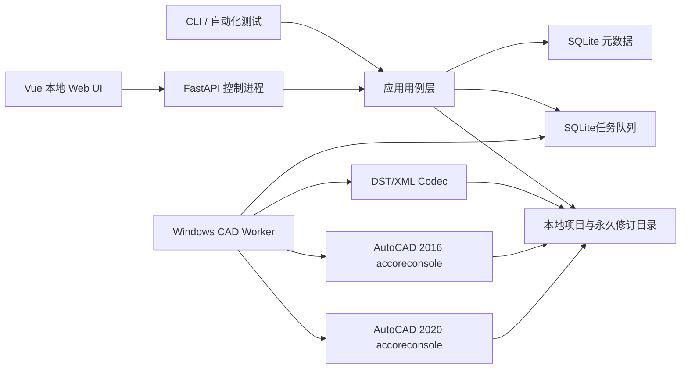

# DST Manager MVP 技术验证设计

> 状态：设计定稿，DM-ADR-001 至 DM-ADR-010 已关闭  
> 定位：完整现代化重构前的独立技术验证项目，不直接替换现有 PowerShell 工具  
> 核心链路：`DST → AcSm XML → 领域命令修改 → DST`；结构预览不启动 CAD，确认后 `DWG → 单次 accoreconsole → rename_only 保留 Handle / rebuild 回读 Handle`
>
> **v0.21 替代说明：** [ADR-DM-001](../adr/ADR-DM-001-controlled-sheetset-editing.md) 与 [SPEC-DM-001](../specs/SPEC-DM-001-v021-sheetset-editing-adjustment.md) 已用受控位置插入和统一派生模型替代本文旧有的自由排序、跨子集移动、手工图号/标题编辑表述。[ADR-DM-002](../adr/ADR-DM-002-v021-cad-single-script-execution.md) 与 [SPEC-DM-002](../specs/SPEC-DM-002-v021-cad-single-script-execution.md) 将每个 DWG 分组的布局重建与 Handle 获取收敛为一次 Core Console；[ADR-DM-003](../adr/ADR-DM-003-deferred-cad-validation-and-subset-cad-operations.md) 与 [SPEC-DM-003](../specs/SPEC-DM-003-deferred-cad-validation-and-subset-cad-operations.md) 进一步规定快速预览无 CAD、确认阶段延期校验及 `none`、`rename_only`、`rebuild` 分流。本文关于 DST/XML、Worker、路径解析、永久快照和可恢复发布的安全基线继续有效；凡编辑能力与 v0.21 规范冲突，均以对应规范和 ADR 为准。

## 1. MVP目标与边界

### 1.1 已确认目标

- 采用混合模式，控制面与 CAD Worker 分进程，但 MVP 全部运行在同一台 Windows 机器。
- 同时验证 AutoCAD 2016 和 AutoCAD 2020，任务必须明确选择版本。
- 使用 SQLite 保存应用元数据，业务文档保存在普通文件夹，不使用对象存储。
- 单用户、无登录；本地服务只绑定 `127.0.0.1`。
- 打开、解码、解析和诊断现有 DST。
- 通过 Web 表单修改图纸集、子集、图纸、布局引用及自定义属性。
- 支持图纸和非空子集按受控位置插入、图纸删除及属性维护，并同步创建或重建受影响 DWG；图号、范围、标题和文件/布局命名由最终结构统一派生。
- 支持从已有布局复制，或依据 DWG/DWT 模板创建空白业务布局。
- 导入原生 AcSm XML，保留未知结构，并导出 DST。
- 每次操作永久保留原 DST、受影响 DWG、输入 XML、执行计划和日志。
- 任何文件锁、CAD脚本、布局回读或结构校验失败都不得发布半成品。

### 1.2 不在MVP范围

- 多用户、账号、权限、SSO和内网服务端部署。
- RustFS、DM8和跨机器任务调度。
- Excel作为主要业务输入。
- SSO COM/Sheet Set Object API写入链路。
- 任意XML编辑器、任意AutoCAD脚本输入或插件在线下载。
- 图框内容智能生成、模型空间重绘和第三方专业插件业务。

MVP要验证的是可被完整系统复用的DST/DWG技术内核，而不是提前实现全部平台能力。

## 2. 现有实现与真实样本证据

### 2.1 DST编解码基础

`plugin/UtilityClass/Class1.cs` 中的 `UtilityClass.DstViewer` 已提供：

- `DstToXmlFile`
- `DstToXml`
- `XmlFileToDst`
- `XmlToDst`

它使用固定256项替换表在DST字节和XML字节之间转换。MVP保留该兼容算法，但在Python侧封装为 `DstCodec` 端口，并增加输入哈希、临时文件、往返校验和错误上下文。Codec只负责无损转换，不负责判断AcSm对象关系是否正确。

### 2.2 DWG处理基础

旧项目已经验证以下链路可工作：

1. `accoreconsole.exe` 打开目标DWG；
2. `NETLOAD` 加载与AutoCAD版本匹配的 `AutoCad Utility.dll`；
3. `dellayouts` 删除除Model外的布局；
4. 使用 `-LAYOUT Template` 从DWG/DWT导入布局并重命名；
5. 可选执行 `Ainsert` 等既有命令；
6. `GetLayoutHandles` 导出布局名和新Handle；
7. Python把新路径、布局名和Handle回写AcSm XML，再编码为DST。

MVP沿用这条路径，不引入COM写DST。

### 2.3 `sample/project1` 审计结果

对 `sample/project1/图纸集数据文件.dst` 只读解码后得到：

| 项目 | 结果 |
| --- | ---: |
| `AcSmSheet` | 298 |
| `AcSmSubset` | 45 |
| 布局引用 | 298 |
| 唯一主DWG引用 | 45 |
| 目录内DWG | 53 |
| 重复XML ID | 0 |
| 缺失的主DWG文件 | 0 |
| 未被DST主引用的DWG | 8 |

样本中的45个子集均只引用一个主DWG，单个DWG包含1至25个图纸布局。8个额外DWG由7个电子签名文件和1个冲突副本组成，不应被自动纳入图纸集。

DST的 `FileName` 保存为旧绝对路径 `C:\test\*.dwg`，`Relative_FileName` 保存为 `\.\*.dwg`。因此路径重定位是打开DST的必要步骤，而不是后续优化。

样本成为MVP首个只读黄金项目。所有自动化测试必须在临时副本上运行，禁止修改仓库中的原样本。

## 3. 总体架构



### 3.1 进程职责

| 进程 | 职责 | 禁止事项 |
| --- | --- | --- |
| API/UI | 表单、预览、命令提交、任务进度、诊断展示 | 不直接改DST/DWG，不启动AutoCAD |
| 应用服务 | 领域校验、生成变更计划、SQLite事务、发布编排 | 不拼接自由格式SCR |
| CAD Worker | 独占任务、暂存文件、运行指定版本Core Console、回传结果 | 不直接修改SQLite，不处理并行写任务 |
| CLI | 环境诊断、批量测试、无UI调用同一应用用例 | 不绕过领域校验 |

同一机器仍保留进程边界，目的是让未来的内网控制面和Windows Worker可以复用同一任务契约，而不是在MVP中实现远程通信。

### 3.2 技术栈

| 层 | MVP选择 |
| --- | --- |
| Python | CPython 3.12 x64 |
| 包与环境 | `uv`、`pyproject.toml`、锁文件 |
| API | FastAPI、Pydantic 2 |
| Web | Vue 3、TypeScript、Vite |
| 数据访问 | SQLAlchemy 2、Alembic、SQLite |
| 本地任务 | SQLite持久任务表、单Worker串行领任务 |
| XML | `lxml`，保留顺序、未知节点、属性和文本 |
| 进程执行 | `subprocess`，参数数组调用，不使用shell字符串 |
| 测试 | pytest、Playwright、真实AutoCAD系统测试 |
| 日志 | Python `logging` + JSON Lines，统一 `operation_id` |

依赖只在实施时锁定补丁版本。领域层不得导入FastAPI、SQLAlchemy、lxml或Windows进程代码。

SQLite 是本地 CAD 预算的权威边界：`claim_next_job` 在 `BEGIN IMMEDIATE` 事务内同时检查活跃 CAD change_set 并领取队首任务，同一数据库任一时刻最多一个 CAD job 进入执行态。Worker 在每次领取前回收过期租约，并在长 CAD 单元等待期间按短于租约的周期续写带 `worker_id + attempt` 的 heartbeat；失去所有权后不得更新新 attempt、补充工作单元或进入发布阶段。`JobFile`、发布替换前的租约闸门及最终 finalize 同样绑定 `worker_id + attempt`，发布中的失权任务进入人工复核，不得被旧 Worker 恢复为成功。

## 4. 领域模型与编辑能力

### 4.1 聚合和值对象

| 对象 | 关键字段 | 责任 |
| --- | --- | --- |
| `Workspace` | 根目录、DST路径、当前修订、默认CAD版本 | 项目文件边界 |
| `SheetSetDocument` | AcSm数据库ID、版本、图纸集属性、原始DOM | DST语义聚合 |
| `Subset` | AcSm ID、名称、顺序、目标DWG | 图纸分组 |
| `Sheet` | AcSm ID、图号、标题、自定义属性、布局引用 | 单张图纸 |
| `LayoutReference` | DWG路径、相对路径、布局名、Handle | DST到DWG的显式连接 |
| `LayoutSource` | 类型、源DWG/DWT、源布局名、源哈希 | 重建内容来源 |
| `ChangeSet` | 基准修订、命令序列、预期结果 | 一次用户编辑 |
| `ExecutionPlan` | 受影响文件、脚本意图、验证规则、发布清单 | 可审阅执行计划 |
| `ValidationIssue` | 代码、级别、对象ID、XPath/文件、建议 | 统一诊断 |

应用内部UUID与AcSm XML ID、DWG Handle分开保存，不允许相互替代。

### 4.2 受支持命令

本节已按 v0.21 的 [受控编辑决策](../adr/ADR-DM-001-controlled-sheetset-editing.md) 和 [行为规范](../specs/SPEC-DM-001-v021-sheetset-editing-adjustment.md) 更新；旧版本的自由排序、跨子集移动及手工图号/标题命令不再受支持。

- 修改图纸集名称，以及图纸集和图纸上已定义的自定义属性值。
- 新增、删除图纸集或图纸自定义属性定义，并按同一领域命令执行 CSV 幂等导入。
- 修改子集可编辑标题；图号范围和子集显示名由最终顺序派生。
- 按目标子集、序号、前后方向和数量批量插入图纸，并使用明确的已有布局或模板布局来源。
- 按图纸集序号、前后方向和至少一张初始图纸插入非空子集；新子集使用明确模板创建独立 DWG。
- 删除图纸；删除后会形成空子集时以 `EMPTY_SUBSET` 拒绝，不能用请求字段绕过该不变量。
- 结构变更完成后统一派生图号、图纸标题及后缀、布局名、子集显示名、主 DWG 文件名和 DST 路径引用。
- 修改工作区路径绑定，但不修改业务内容。

`move_sheet`、`reorder_sheet`、独立子集排序、手工重编号，以及带图号或标题的旧 `update_sheet` 命令均被拒绝。API、Web 和 CAD Worker 只消费同一预览及派生结果，不另行实现自由调整或命名算法。

“空白业务布局”指从指定模板布局复制图框、页面设置和预置对象，再改为新布局名；不是调用 `Layouts.Add` 创建不含模板内容的AutoCAD空布局。Web表单必须要求选择模板文件和模板布局。

### 4.3 暂不支持的编辑

- 修改XML `clsid`、`vt`、数据库版本或任意未知节点。
- 在Web中直接编辑布局Handle或AcSm GUID。
- 将多个子集绑定同一主DWG。
- 自动猜测新增图纸应使用的模板。
- 自动合并文件名相同但内容不同的DWG。

## 5. 路径解析与重绑定

打开DST时，按以下顺序解析每个布局引用：

1. `Relative_FileName` 相对于DST目录；
2. `FileName` 指向的现存绝对路径；
3. DST目录中与引用文件名完全一致的DWG；
4. 用户明确选择的新根目录。

规则如下：

- 成功匹配后在内存中记录解析来源，不立即写文件。
- 同一候选层出现多个同名文件时报告 `DWG_PATH_AMBIGUOUS` 并阻止保存。
- 未找到主DWG时允许只读打开，但同步保存被阻止。
- 未被DST引用的DWG仅显示为诊断信息，不自动导入。
- 发布时同时写入规范绝对 `FileName` 和以DST目录为基准的 `Relative_FileName`。
- 禁止通过通配符、模糊中文匹配或修改后缀猜测文件。

## 6. 布局 CAD 操作协议

### 6.1 布局来源

每个目标布局必须拥有明确的 `LayoutSource`：

- `existing_snapshot`：从操作开始前的原DWG快照导入指定布局；
- `template_layout`：从用户选择的DWG/DWT模板导入指定布局；
- `moved_sheet`：本质上仍从源DWG快照导入，只是目标DWG发生变化。

已有图纸保留其原布局内容；删除图纸不会进入目标计划；新增图纸必须选择已有布局或模板布局。快速预览只采集来源路径、存在性、文件身份与 SHA-256，不启动 Core Console，也不枚举 DWG 布局；真正的来源布局存在性、完整布局集合和 CAD 版本校验延后到用户确认后的暂存工作单元中执行。

### 6.2 重排与命名

提交编辑后，领域服务先计算最终顺序，再统一派生：

- 图号；
- 布局名；
- 子集显示名；
- 主DWG文件名；
- `FileName`和`Relative_FileName`；
- 每个目标DWG的有序布局清单。

重命名规则沿用旧项目规则，并作为独立可测试策略实现。插入和删除不会对原XML就地逐字符修补，而是根据最终计划重建受控节点及受影响DWG。

### 6.3 单个 DWG 的操作分流

领域规划器先按数量变化前沿确定 CAD 工作范围，再逐子集分类：稳定图纸 ID、顺序、来源以及按十六进制数值合法、非零且在同一目标 DWG 内唯一的 Handle 均可证明时使用 `rename_only`；数量、集合、顺序、内容来源或 Handle 资格变化时使用 `rebuild`；范围外且无布局差异时为 `none`。前沿只扩大工作范围，不把可证明安全的下游单元强制升级为重建。发布前再次按 `(resolved DWG casefold, int(handle, 16))` 检查全部最终图纸，允许不同 DWG 复用同一 Handle，禁止同一 DWG 内的数值重复。

Python 不接受用户提供 SCR 文本，只把结构化意图渲染为固定脚本。每个 `rename_only` 或 `rebuild` 工作单元在暂存 DWG 上只调用一次 Core Console，并与所有其他单元共享 `cad_max_parallel` 预算；默认值为 4，合法范围为 1–10。

- `rename_only` 调用受限的 `DstRenameLayouts`；Python 按暂存 DWG 派生固定请求/结果副文件，SCR 只执行 `NETLOAD` 和无参数命令，插件从当前 DWG 派生 sidecar 路径。命令先验证完整纸空间布局集合，再经任务生成的临时名称执行交换、循环和仅大小写改名。它不调用 `DstDeleteLayouts`、布局导入或 `DstGetLayoutHandles`，派生 DST 保留原 `AcDbHandle`。
- `rebuild` 在同一脚本和 Core Console 会话中完成布局删除、按最终顺序导入、默认布局清理、Handle 获取、校验和保存；Python 只接受完整、非零且无重复的 Handle 结果。

确认后的来源基准漂移、插件协议错误、结果副文件缺失、任一 CAD 单元失败、DST DOM 复核失败或发布失败，都必须使整批任务失败并保持正式文件不变。独立新进程重新打开最终暂存 DWG 只属于第 12.2 节的双版本系统验收和诊断，不是生产任务的第二次 CAD 调用。

### 6.4 双AutoCAD版本

配置分别声明：

- `accoreconsole.exe`绝对路径；
- 对应 `AutoCad Utility.dll`；
- 支持的DWG格式与插件构建标识；
- 命令语言参数 `zh-CN`；
- 单任务超时。

每个任务只能选择2016或2020之一。不得通过注册表“当前版本”或PATH自动选择。黄金样本需要在两个版本各完成一次完整重建，但不同版本生成的DWG只做语义比较，不做二进制逐字节比较。

## 7. XML导入、修改与DST导出

### 7.1 XML兼容边界

导入对象必须以 `AcSmDatabase` 为根，并满足MVP支持的原生AcSm结构。导入器：

- 保留未知元素、未知属性、元素顺序、`clsid`、`vt`和自定义属性；
- 建立领域投影，但原始DOM仍是导出载体；
- 只通过受控命令修改已知XPath；
- 新建对象使用经过黄金样本验证的节点模板和新GUID；
- 删除对象时只删除该对象拥有的受控子树，不全局清理未知引用；
- 导出前后执行ID唯一性和引用完整性检查。

### 7.2 结构校验

阻断性校验至少包括：

- 根元素、数据库版本和图纸集节点存在；
- 所有 `ID` 唯一且格式合法；
- 每个Sheet恰好有一个布局引用、Number和Title；
- 每个布局引用具有FileName、Relative_FileName、Name和有效Handle；
- 子集、图纸和布局顺序与执行计划一致；
- 主DWG文件存在且布局名/Handle可由回读清单对应；
- 同一目标DWG内布局名不重复；
- 编码后的DST再次解码，所得XML与发布DOM语义等价。

未知节点不会导致失败，除非它引用了被删除对象且无法证明安全；此时报告 `UNKNOWN_REFERENCE_BLOCKED`，要求人工处理。

### 7.3 DST生成顺序

1. 复制原始DOM到任务暂存区。
2. 应用受控元数据和结构命令。
3. 完成所有 `rename_only`/`rebuild` CAD 工作；改名单元保留原 Handle，重建单元回读完整 Handle。
4. 把最终路径与布局名写入暂存 XML，并只为重建单元应用新 Handle 绑定。
5. 运行结构和引用校验。
6. 编码为暂存DST。
7. 重新解码暂存DST并做语义往返比较。
8. 进入发布流程。

## 8. 文件事务、永久修订与恢复

### 8.1 工作目录

```text
<项目目录>/
├─ 图纸集数据文件.dst
├─ *.dwg
└─ .dst-manager/
   ├─ workspace.json
   ├─ revisions/
   │  └─ <operation-id>/
   │     ├─ manifest.json
   │     ├─ before/
   │     │  ├─ 图纸集数据文件.dst
   │     │  └─ <受影响DWG>
   │     ├─ input/
   │     │  └─ imported.xml
   │     ├─ plan/
   │     │  ├─ change-set.json
   │     │  └─ execution-plan.json
   │     └─ logs/
   └─ jobs/
      └─ <operation-id>/
         ├─ staging/
         ├─ scripts/
         ├─ handles/
         └─ publish-journal.json
```

修订目录永久保留，不提供自动清理。任务成功后可删除可再生的 `jobs/<operation-id>/staging`，但发布日志和执行日志归档到对应revision；是否清理临时副本由显式维护命令控制。

### 8.2 整批事务语义

Windows文件系统没有跨多个文件的原子事务，MVP使用可恢复发布协议实现用户可见的整批成功/失败：

1. 对原DST和所有受影响DWG计算SHA-256，并尝试取得排他写锁。
2. 把原文件永久复制到revision的 `before`，复制后校验哈希。
3. 所有修改只发生在job暂存区。
4. 暂存成果全部通过校验后写入 `publish-journal.json`，状态为 `PREPARED`。
5. 对每个目标文件在同卷创建临时发布文件，再用 `os.replace` 逐文件原子替换；每一步同步记录日志。
6. 任一步失败立即按 `before` 逆序恢复已替换文件并校验哈希。
7. 全部替换成功后标记 `COMMITTED`，更新SQLite当前修订。
8. 应用启动时扫描未终结发布日志，自动完成回滚，不允许带着半发布状态继续编辑。

同一工作区同一时刻只允许一个写任务。文件锁、基准哈希变化、磁盘空间不足或恢复失败均为阻断错误。

### 8.3 文件锁策略

- 计划执行前检查DST、受影响DWG、模板和源DWG快照。
- DST或任一受影响DWG无法取得排他写访问时，整批任务进入 `BLOCKED_FILE_LOCK`，不启动AutoCAD。
- 模板只要求可读，但任务期间复制到暂存区并使用固定哈希，避免执行中被替换。
- 不自动结束AutoCAD进程，不尝试绕过Windows锁，不无限重试。

## 9. SQLite数据模型

SQLite不保存DST/DWG二进制，只保存索引和任务状态。

| 表 | 主要字段与职责 |
| --- | --- |
| `workspaces` | 根目录、DST路径、当前修订、默认CAD版本、版本号 |
| `document_revisions` | operation ID、基准/结果哈希、revision目录、创建时间 |
| `change_sets` | 命令JSON、基准修订、状态、校验摘要 |
| `jobs` | 类型、CAD版本、状态、进度、开始/结束时间、错误码 |
| `job_files` | 源/目标路径、前后哈希、角色、`cad_operation`、开始/结束时间、耗时、内存与处理结果 |
| `diagnostics` | 级别、代码、对象ID、XPath/文件路径、消息 |
| `templates` | 模板路径、哈希、可用布局、适用CAD版本 |
| `application_settings` | Core Console、插件、超时和本地文档配置 |

数据库启用外键和WAL。API进程是唯一数据库写入者；Worker通过本地任务请求/结果文件或进程间消息返回结果。任务状态机：

```text
DRAFT → VALIDATED → QUEUED → STAGING → CAD_RUNNING
      → VERIFYING → PREPARED → PUBLISHING → SUCCEEDED
任意执行阶段 → FAILED / BLOCKED_FILE_LOCK / ROLLING_BACK → ROLLED_BACK
```

## 10. API、Web表单与用户流程

### 10.1 最小API

| 方法 | 路径 | 作用 |
| --- | --- | --- |
| `POST` | `/api/workspaces/open` | 打开DST并解析项目 |
| `GET` | `/api/workspaces/{id}` | 获取图纸集、诊断和路径绑定 |
| `POST` | `/api/workspaces/{id}/changes/preview` | 校验命令并生成差异计划 |
| `POST` | `/api/workspaces/{id}/changes/execute` | 提交已确认计划 |
| `POST` | `/api/workspaces/{id}/xml/import/preview` | 导入XML并展示结构差异 |
| `POST` | `/api/workspaces/{id}/xml/export-dst` | 校验并提交DST导出任务 |
| `GET` | `/api/jobs/{id}` | 查询进度、结果、错误，以及逐文件 `cad_operation`、`started_at`、`finished_at` |
| `GET` | `/api/jobs/{id}/events` | SSE任务事件 |
| `GET` | `/api/revisions` | 查看永久修订 |
| `POST` | `/api/layout-names` | 用Core Console枚举DWG/DWT布局名（SHA-256缓存） |
| `GET` | `/api/system/cad-capabilities` | 检测2016/2020与插件 |

所有写API要求提交 `base_revision_id`。基准已变化时返回409，用户必须重新预览。

### 10.2 Web页面

- 打开项目：选择DST、显示路径重定位结果和阻断诊断。
- 图纸集概览：图纸集属性、子集、DWG数量、未引用文件。
- 图纸编辑器：树形子集＋可排序图纸表格，支持插入、删除、拖动和批量属性编辑。
- 新增图纸表单：图号位置、标题、自定义属性、目标子集、来源类型、来源布局或模板布局。
- 变更预览：展示图号、布局名、子集、DWG 文件名、数量变化前沿、`none`/`rename_only`/`rebuild` 及 CAD 校验延后提示。
- XML导入：只显示语义差异和诊断，不提供原始XML任意编辑框。
- 任务详情：逐 DWG 操作类型、开始/结束时间、耗时、Core Console 版本、日志、Handle 回读和回滚状态。
- 修订历史：永久快照、哈希和操作清单；MVP只提供“查看和导出”，恢复作为后续命令实现。

用户必须在变更预览页明确确认后才执行CAD任务。

## 11. 项目目录建议

```text
dst-manager/
├─ pyproject.toml
├─ uv.lock
├─ src/dst_manager/
│  ├─ domain/
│  │  ├─ models.py
│  │  ├─ commands.py
│  │  ├─ naming.py
│  │  ├─ planning.py
│  │  └─ validation.py
│  ├─ application/
│  │  ├─ ports.py
│  │  ├─ open_workspace.py
│  │  ├─ preview_changes.py
│  │  ├─ execute_changes.py
│  │  └─ import_xml.py
│  ├─ infrastructure/
│  │  ├─ dst_codec/
│  │  ├─ acsm_xml/
│  │  ├─ autocad/
│  │  │  ├─ executor.py
│  │  │  ├─ script_renderer.py
│  │  │  └─ handle_parser.py
│  │  ├─ filesystem/
│  │  │  ├─ revisions.py
│  │  │  └─ publisher.py
│  │  └─ persistence/
│  ├─ interfaces/
│  │  ├─ api/
│  │  ├─ cli/
│  │  └─ worker/
│  └─ config.py
├─ web/
├─ migrations/
├─ tests/
│  ├─ unit/
│  ├─ integration/
│  ├─ golden/
│  └─ system_autocad/
├─ plugins/
│  ├─ autocad2016/
│  └─ autocad2020/
└─ docs/
```

MVP可以在现仓库内先建立上述子目录，验证完成后再决定是否拆分仓库。

## 12. 测试策略

### 12.1 无AutoCAD自动化测试

- 256字节映射表的全值往返测试。
- DST解码→XML→DST→XML语义往返测试。
- 未知XML节点、属性和顺序保留测试。
- GUID唯一性、节点模板和删除引用测试。
- 298张样本的解析快照和路径重定位测试。
- 受控插入、删除、空子集拒绝和统一派生的表驱动测试。
- 图号、布局名、子集名和DWG文件名派生测试。
- SCR渲染黄金测试和危险字符拒绝测试。
- 快速预览不调用 CAD、操作分类、`rename_only` Handle 保持和混合失败不发布测试。
- SQLite状态机、崩溃恢复和并发基准修订测试。
- 多文件发布在第N个文件失败时的逐点回滚测试。

### 12.2 真实AutoCAD系统测试

AutoCAD 2016和2020分别执行：

1. 检测Core Console和对应插件。
2. 枚举样本DWG布局和Handle。
3. 从原DWG快照重建多布局DWG。
4. 从DWG/DWT模板创建空白业务布局。
5. 对稳定图纸集合执行布局交换、循环、仅大小写和标题改名，并独立比较改名前后 Handle。
6. 插入或删除图纸后核对重建布局顺序；空子集请求必须在预览阶段拒绝。
7. 对25布局的样本最大分组执行完整重建。
8. 解析生产单脚本写出的每个最终布局唯一Handle，并与执行计划匹配。
9. 另启一个新的 Core Console 进程重新打开最终暂存 DWG，独立读取布局与 Handle；该步骤只用于双版本系统验收/诊断，不计入正常生产任务调用。
10. 用生成DST关联最终DWG，在对应AutoCAD桌面环境进行验收打开。
11. 对 10 个混合工作单元以并发度 1、4、10 分别记录墙钟、任务时长、逐文件耗时和峰值内存。

AutoCAD桌面验收可以人工触发，但必须记录版本、结果和证据文件。Core Console日志中出现未识别命令、脚本中断、致命错误或超时均视为失败。

### 12.3 故障测试

- DST被AutoCAD锁定。
- 一个受影响DWG被锁定。
- 模板执行期间发生变化。
- Core Console非零退出、超时或被终止。
- 插件版本与AutoCAD不匹配。
- 缺少源布局、产生重复布局名或Handle回读缺项。
- 暂存空间不足。
- 发布第一个、中间和最后一个文件时失败。
- 进程在 `PREPARED`、`PUBLISHING` 和 `ROLLING_BACK` 状态崩溃后重启。

## 13. 实施阶段与退出条件

### 阶段0：黄金样本和环境探针

- 固化 `sample/project1` 清单和哈希，不修改原文件。
- 建立AutoCAD 2016/2020、插件和模板能力探针。
- 解码样本并生成可重复的结构报告。

退出条件：两个Core Console均可执行最小脚本，样本解析结果稳定为298张图、45个子集和45个主DWG。

### 阶段1：DST/XML内核

- 实现Codec端口、AcSm DOM适配器、领域投影和结构校验。
- 实现打开、路径重定位、XML导入和DST导出。
- 对未知节点保留和往返等价建立自动化测试。

退出条件：样本往返无受控字段语义差异，损坏输入能输出明确错误码。

### 阶段2：编辑计划与SQLite

- 实现图纸插入、删除、排序、跨子集移动和命名派生。
- 实现SQLite模型、修订、任务状态机和差异预览。
- 实现模板/已有布局来源校验。

退出条件：所有命令都能在不写文件的情况下产生确定、可审阅的执行计划。

### 阶段3：CAD Worker与双版本验证

- 实现固定SCR渲染器、Core Console执行器和Handle解析器。
- 分别构建/确认2016和2020插件。
- 用临时副本完成样本DWG重建和空白模板布局创建。

退出条件：双版本系统测试全部通过，布局名、顺序和Handle与计划一一对应。

### 阶段4：事务发布

- 实现永久before快照、暂存、发布日志、逐文件原子替换和恢复。
- 注入发布故障验证整批回滚。

退出条件：任何测试故障后正式目录要么保持旧版本，要么完整成为新版本，不存在混合版本。

### 阶段5：本地Web MVP

- 实现打开、编辑、模板选择、预览、执行、任务和修订页面。
- 用Playwright覆盖主流程。
- 由用户使用真实项目完成验收。

退出条件：不依赖Excel即可完成一次打开、插入、删除、重排、DWG同步和DST导出。

## 14. MVP验收标准

- `sample/project1` 原件始终不被修改，测试只使用可验证副本。
- 正确解析298张图、45个子集、45个主DWG和8个额外DWG。
- 旧绝对路径失效时能通过相对路径确定性重定位全部45个主DWG。
- Web表单支持图纸插入、删除、重排及跨子集移动，并在执行前展示完整文件差异。
- 新图纸可从已有布局或明确选择的DWG/DWT模板布局创建。
- 受影响DWG通过选定版本Core Console删除旧布局并按最终顺序重建。
- 298个布局引用的路径、布局名和Handle与最终DWG一致。
- 原生AcSm XML导入保留未知结构，导出的DST可往返解码且语义一致。
- AutoCAD 2016和2020都完成真实DWG和DST验收。
- 文件锁或任一步失败时不发布半成品；注入故障后可自动恢复。
- 每次操作永久保留原DST、受影响DWG、输入、计划、哈希和日志。
- SQLite与普通项目目录整体复制后可以在另一目录恢复打开。

## 15. 架构决策记录

| 决策 | 结论 | 状态 |
| --- | --- | --- |
| DM-ADR-001 | 同机控制进程＋独立CAD Worker，保留未来远程契约 | 已确认 |
| DM-ADR-002 | MVP同时验证AutoCAD 2016和2020 | 已确认 |
| DM-ADR-003 | DST采用旧项目已验证的XML编解码路径，不使用SSO COM | 已确认 |
| DM-ADR-004 | 允许删除旧布局并通过Core Console重建 | 已确认 |
| DM-ADR-005 | 支持插入、删除、排序、跨子集移动；默认一子集一DWG | 已确认 |
| DM-ADR-006 | 已有布局来自原DWG快照；新增布局可来自已有布局或DWG/DWT模板 | 已确认 |
| DM-ADR-007 | 图号变化同步重算布局、子集、DWG文件名和相对/绝对路径 | 已确认 |
| DM-ADR-008 | 导入原生AcSm XML，保留未知节点，只修改受控字段 | 已确认 |
| DM-ADR-009 | 每次操作永久保存原DST、受影响DWG、输入、计划和日志 | 已确认 |
| DM-ADR-010 | 整批事务语义；锁定或失败不发布，发布异常自动回滚 | 已确认 |

当前不存在需要产品决策的开放灰区。实施过程中若真实样本证明模板布局、命名规则或未知XML引用存在本文未覆盖的语义，必须新增ADR并询问用户，不能通过代码默认值擅自处理。
