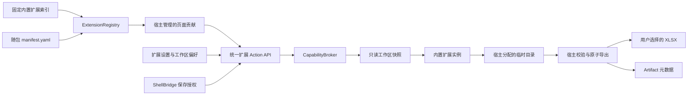

# DST Manager 内置扩展平台首期架构

> 定位：实现 [PRD-DM-001](../product/prds/PRD-DM-001-extensible-capability-platform.md) 第一阶段“扩展基础与只读试点”的权威架构，以“导出图纸目录”验证清单、启停、最小能力、只读快照、受控页面贡献和 Artifact 链路。
>
> 核心裁决：首期只加载随主程序打包且在代码白名单中登记的受信内置扩展；扩展不能取得完整应用服务、数据库会话、可写 AcSm DOM、正式工程路径或发布器。

## 1. 背景与目标

DST Manager 已经形成领域、应用、基础设施和接口四层边界，但新增业务功能仍需直接修改固定路由、`DstManagerService` 和标签栏。继续按此方式叠加目录导出、报告、打包和连接器，会使可选能力无法独立启停、故障无法隔离，并扩大正式工程写入面。

本架构建立一个最小但真实的内置扩展平台纵向切片，目标如下：

- 从随包清单发现、校验、启用、停用和诊断内置扩展；
- 通过按扩展身份裁剪的能力上下文提供只读工作区快照；
- 由宿主统一拥有路由、导航、配置、目标路径、Artifact 和审计；
- 验证扩展停用、损坏或不兼容时核心宿主仍可启动并使用；
- 避免把首个图纸目录功能实现为无法复用的固定 API 特例；
- 为后续 Artifact 中心、受控 CAD 作业、连接器和 sidecar 保留版本化契约，但不提前实现这些阶段。

## 2. 范围与非目标

### 2.1 首期范围

- 内置扩展清单 Schema、固定代码白名单和宿主契约版本；
- 扩展注册表、启停状态、兼容性诊断和同步调用生命周期；
- `CapabilityBroker`、作用域化 `ExtensionContext` 和只读工作区快照；
- 宿主管理的工作区页面贡献点和扩展动作端点；
- 按 `extension_id` 隔离的应用级设置与工作区偏好；
- 用户明确选择目标位置的一次性保存授权；
- 成功 Artifact 的元数据登记和文件可用性判断；
- 首个内置扩展 `dst-manager.sheet-catalog`。

### 2.2 非目标

- 扫描用户目录、Python entry point、未知包动态导入、在线安装、市场或自动更新；
- 第三方代码沙箱、进程级资源限制或公开扩展 SDK；
- `Change Proposal`、受控 AutoCAD 作业、连接器、sidecar 或嵌入应用；
- 通用后台扩展任务队列、Artifact 管理中心、重新下载或自动清理策略；
- 允许扩展自建 FastAPI 路由、直接修改 Vue Router、插入任意 DOM 或访问 ShellBridge；
- 把 AutoCAD Worker Plugin 纳入普通业务扩展注册表。

## 3. 总体结构



依赖方向保持为：

```text
interfaces → application/extensions → domain
                           ↓
                  infrastructure adapters
```

扩展契约和值对象属于应用层，不进入通用领域模型；清单读取、SQLite、文件系统、XLSX 和 ShellBridge 适配属于基础设施或接口层。`DstManagerService` 只组合扩展平台入口，不承载注册、表达式、XLSX 或 Artifact 细节。

## 4. 扩展清单与受信加载

### 4.1 固定索引

宿主维护代码级 `BuiltinExtensionIndex`，每个条目直接引用已审核的工厂函数和随包清单资源。清单不得携带 Python 模块名、类名、脚本路径或可执行命令，避免把数据文件变成任意导入入口。

推荐目录边界：

```text
src/dst_manager/extensions/
├─ contracts.py
├─ registry.py
├─ capabilities.py
├─ snapshots.py
├─ settings.py
├─ artifacts.py
├─ save_grants.py
└─ builtin/
   ├─ index.py
   └─ sheet_catalog/
      ├─ manifest.yaml
      ├─ extension.py
      ├─ expressions.py
      └─ workbook.py
```

### 4.2 清单契约

首期清单至少包含：

```yaml
extension_id: dst-manager.sheet-catalog
version: 0.1.0
extension_type: builtin
host_contract: 1
enabled_by_default: true
name_key: extensions.sheetCatalog.name
description_key: extensions.sheetCatalog.description
required_capabilities:
  - workspace.snapshot.read.v1
permissions:
  - workspace.snapshot.read
  - artifact.output.propose
ui_contributions:
  - contribution_id: workspace-page
    kind: workspace_page
    route_key: sheet-catalog
actions:
  - export-xlsx
settings_schema: 1
```

`extension_id`、贡献 ID 和动作 ID 使用稳定英文标识。用户文案使用 [ARCH-DM-005](ARCH-DM-005-multilingual-support.md) 的 i18n key，不把中文作为协议字段。

`artifact.output.propose` 只允许扩展返回由宿主校验的候选输出，不向扩展暴露 Artifact 仓储或文件目标；最终文件保存、哈希计算和 Artifact 登记仍完全由宿主执行。

### 4.3 校验与故障隔离

宿主启动先完成发布恢复和数据库迁移，再发现扩展。清单缺失、字段无效、ID 重复、版本不兼容、能力缺失或工厂启动失败只使对应扩展进入不可用状态；不得阻止 FastAPI、核心页面、CAD Worker 或其他扩展启动。

发布包只包含固定索引引用的扩展；诊断和关于信息能够列出实际扩展 ID、扩展版本、清单摘要和宿主契约版本。

## 5. 注册表与生命周期

首期支持以下状态：

```text
DISCOVERED → DISABLED
DISCOVERED → STARTING → AVAILABLE
DISCOVERED → WAITING_DEPENDENCY
DISCOVERED → INCOMPATIBLE
STARTING / AVAILABLE → FAILED
AVAILABLE → STOPPING → STOPPED
STOPPED → STARTING
```

规则如下：

- 启用状态跨应用重启保留；未存储状态时使用清单默认值。
- 启用时先校验宿主契约、必需能力和设置 Schema，再创建扩展实例和页面贡献。
- 停用时先移除新入口并拒绝新调用，再等待当前同步调用结束，最后释放生命周期资源。
- 首期扩展不得注册后台计时器、外部进程或网络连接；生命周期仍统一跟踪页面贡献、动作处理器和活动调用计数。
- 停用清理失败进入 `FAILED`，不能显示为已停止。
- 用户正位于被停用页面且存在未保存模板草稿时，宿主先执行未保存确认，再返回“图纸”页并恢复焦点。

## 6. Capability 与只读快照

### 6.1 Capability Broker

扩展只能通过短生命周期 `ExtensionContext` 请求清单已声明、宿主已允许且当前可用的能力。每次上下文绑定 `extension_id`、`workspace_id`、`revision_id` 和 invocation ID；调用完成后失效。

扩展上下文不得暴露：

- `DstManagerService`；
- SQLAlchemy Session 或数据库对象；
- `Workspace`、`SheetSetDocument` 等可变领域对象；
- AcSm DOM、发布器、恢复器、任务队列或 ShellBridge；
- 工作区根目录、DST 绝对路径、DWG 绝对路径或任意文件句柄。

### 6.2 图纸目录快照

`workspace.snapshot.read.v1` 返回冻结、可序列化的最小投影：

```text
workspace_id
revision_id
sheetset:
  custom_property_definitions[]
  custom_properties{}
sheets[]（按子集顺序、图纸顺序展平）:
  sheet_id
  number
  title
  file_name（仅 basename）
  custom_property_definitions[]
  custom_properties{}
```

图纸集属性定义来自 `sheetset` 作用域；图纸属性定义沿用现有 `sheet_property_definitions` 和实际投影的并集，并按现有大小写不敏感规则规范化。快照只包含文件名 basename，不包含 `resolved_path`、`FileName` 绝对路径或 `Relative_FileName`。

快照构建只读取当前 DST 投影和应用数据库，不创建工程内 `.dst-manager/`，不写 DST/DWG，不改变工程文件时间戳。扩展不得持有快照以外的宿主对象。

## 7. 页面与动作贡献

首期只实现 `workspace_page`。清单中的 `route_key` 必须存在于宿主编译期的前端组件映射；扩展不能提交 URL、HTML、JavaScript、CSS 或 Vue 模块路径。

宿主根据扩展状态和工作区状态生成导航：

- 扩展可用且工作区已加载时显示独立“图纸目录”页面；
- 扩展停用、失败或不兼容时移除页面入口；
- 核心“图纸、属性、修订历史”页面及顺序不被扩展替换；
- 页面沿用宿主令牌、主题、键盘和焦点规则。

扩展动作通过统一版本化端点调用，扩展不得自行挂载 FastAPI router：

```text
GET   /api/extensions
PATCH /api/extensions/{extension_id}/state
GET   /api/extensions/{extension_id}/settings
PUT   /api/extensions/{extension_id}/settings
GET   /api/extensions/{extension_id}/workspaces/{workspace_id}/preferences
PUT   /api/extensions/{extension_id}/workspaces/{workspace_id}/preferences
POST  /api/extensions/{extension_id}/actions/{action_id}/preview
POST  /api/extensions/{extension_id}/actions/{action_id}/execute
GET   /api/artifacts/{artifact_id}
```

统一分派器负责扩展状态、动作声明、能力、请求 Schema、工作区和错误映射；具体动作处理器只处理已验证的结构化请求。

## 8. 设置与工作区偏好

### 8.1 应用级扩展设置

扩展设置与 [ARCH-DM-004](ARCH-DM-004-settings-center.md) 的核心应用设置分离，按 `extension_id` 保存 `schema_version`、乐观并发 `revision` 和 `value_json`。扩展只能通过宿主提供的设置端口读取自身命名空间，不能自行迁移数据库。

图纸目录的用户命名模板属于应用级扩展设置，可跨图纸集复用。内置默认模板来自随包代码，不写入数据库、不可覆盖或删除。停用扩展保留设置。

### 8.2 工作区偏好

工作区偏好只保存上次选中的已保存模板 ID。选择模板后宿主以 best-effort 方式更新偏好；偏好保存失败不阻止当前预览或导出，但必须可诊断。未保存草稿不进入工作区偏好。

## 9. 保存授权与 Artifact

### 9.1 一次性保存授权

前端不能直接向 API 提交任意绝对输出路径。桌面壳新增固定用途的保存方法，由宿主提供建议文件名和固定 `.xlsx` 过滤器。用户确认后，壳与 API 共享的 `SaveGrantStore` 创建随机、一次性、短时有效的 `save_grant_id`，并绑定：

- `extension_id` 与 `action_id`；
- `workspace_id`；
- 规范化目标 `.xlsx` 路径；
- 选择时目标文件的存在性、身份和 SHA-256；
- 创建时间和失效时间。

扩展只得到宿主临时输出目录，不得到授权 ID 对应路径。授权被取消、过期、重复使用、用途不匹配或目标基准漂移时必须拒绝。

### 9.2 原子导出

1. 用户先通过原生“另存为”选择目标；取消时立即结束，不生成文件。
2. 扩展在应用临时目录生成候选 XLSX。
3. 宿主重新打开候选文件，验证格式、工作表、表头、行数和禁止特性。
4. 宿主在目标目录创建同卷唯一临时文件，复制、刷新并按平台能力落盘。
5. 宿主再次核对目标基准后使用 `os.replace` 原子替换。
6. 成功后计算最终文件哈希、大小并登记 Artifact；最后删除应用临时文件。
7. 任一步失败清理候选和目标临时文件，不登记成功 Artifact，不修改 DST/DWG。

### 9.3 Artifact 语义

首期 Artifact 是后台权威元数据，不要求在普通页面展示来源修订和哈希。成功记录至少包含：

```text
artifact_id
extension_id / extension_version
workspace_id / source_revision_id
kind / media_type
management_relation = external
output_path / file_name
size_bytes / sha256
created_at
```

文件由用户管理，应用不永久保存重复副本。后续查询发现路径缺失或哈希变化时可派生 `MISSING` 或 `CHANGED` 可用性状态，但历史记录不伪装成当前可用文件。失败尝试进入诊断或操作日志，不创建成功 Artifact。

## 10. SQLite 模型

首期新增四组宿主管理表：

| 表 | 主要字段与约束 |
| --- | --- |
| `extension_states` | `extension_id` 唯一、enabled、last_loaded_version、last_error_code、updated_at |
| `extension_settings` | `extension_id` 唯一、schema_version、revision、value_json、updated_at |
| `workspace_extension_preferences` | workspace_id + extension_id 联合唯一、schema_version、value_json、updated_at |
| `artifacts` | artifact_id、extension/version、workspace/revision、kind、media_type、management_relation、output_path、file_name、size、sha256、created_at |

数据库只由宿主仓储层访问。模型变化通过新的 Alembic revision 实施并验证全新数据库升级；扩展代码不接收表对象，也不能执行迁移。

## 11. 同步执行与并发

图纸目录预览和 XLSX 生成首期同步执行，不进入现有 CAD `jobs` 队列。注册表按扩展维护活动调用计数；停用先拒绝新调用，再等待已有调用结束。

每次预览绑定 `workspace_id`、`base_revision_id` 和规范化模板摘要，生成 `preview_digest`。执行阶段重新构建快照并核对三者；来源修订、模板、能力或扩展状态变化均返回 `REPREVIEW_REQUIRED`。

同一 `save_grant_id` 只能有一个执行者。多个不同授权可以并发导出；它们不取得工作区写锁，也不能阻塞 CAD 发布。若生成耗时达到后续 Spec 定义的长任务阈值，应另立扩展任务设计，不在首期中复用 CAD 状态机或临时增加后台线程。

## 12. 错误与可观察性

稳定错误码至少覆盖：

| 错误码 | 含义 |
| --- | --- |
| `EXTENSION_NOT_FOUND` | 扩展未登记 |
| `EXTENSION_DISABLED` | 扩展已停用或正在停用 |
| `EXTENSION_INCOMPATIBLE` | 宿主契约不兼容 |
| `EXTENSION_CAPABILITY_UNAVAILABLE` | 必需能力不可用 |
| `EXTENSION_SETTINGS_INVALID` | 设置 Schema 或数据无效 |
| `EXTENSION_ACTION_NOT_FOUND` | 动作未声明 |
| `SAVE_GRANT_INVALID` | 保存授权不存在、过期、重复使用或不匹配 |
| `EXPORT_DESTINATION_CHANGED` | 目标在选择后发生变化 |
| `REPREVIEW_REQUIRED` | 来源修订或模板摘要已变化 |
| `ARTIFACT_WRITE_FAILED` | 候选生成、验证或最终保存失败 |

错误响应遵循 ARCH-DM-005 的 `code`、`message_key`、`params` 和兼容 `message` 结构。日志关联 invocation ID、扩展 ID、版本、工作区和来源修订；不记录表达式求值后的敏感属性值，不把完整输出路径写入普通日志。

## 13. 兼容性与发布

- `host_contract` 首期为整数 `1`；扩展声明的值必须等于宿主支持值。
- 清单或设置 Schema 的不兼容变化必须增加版本并提供宿主管理的迁移。
- 扩展版本遵循 SemVer，与主程序一同构建、测试和发布。
- PyInstaller 打包显式包含固定索引引用的清单和扩展资源；不通过文件扫描猜测扩展。
- `openpyxl` 作为运行时依赖由 UV 锁定并纳入许可证与打包验证。
- 禁用全部非核心扩展后，现有核心 API、页面、CAD Worker 和发布恢复继续工作。

## 14. 架构验收

- 损坏、重复、不兼容或启动失败的清单不会阻止宿主和其他扩展启动。
- 测试扩展无法取得完整服务、数据库、可写 DOM、发布器或正式文件路径。
- 图纸目录仅依赖带修订身份的只读快照即可生成候选成果。
- 只读打开、预览和导出不创建工程管理目录，不修改 DST/DWG 或工程文件时间戳。
- 停用后页面与动作消失，活动同步调用得到安全终态，核心页面仍可用。
- 保存授权无法被伪造、复用、越权或改作其他扩展和路径。
- 目标漂移或任一步失败不留下半写 XLSX，也不登记成功 Artifact。
- 成功 Artifact 可追溯到扩展、宿主工作区和来源修订；普通前端不强制展示技术元数据。
- 全新数据库可从头升级，既有数据库迁移后核心回归通过。

## 15. 后续演进边界

以下能力必须另立 Spec、Architecture 或 ADR，不得通过扩大本首期接口静默加入：

- 通用 Artifact 管理、保留、重新导出和打包；
- 持久扩展任务、取消、恢复和重试；
- 受控 AutoCAD 作业登记与 Artifact-only 执行；
- 连接器凭据、网络代理和同步冲突；
- sidecar、嵌入页面和候选文件；
- 用户安装包、第三方签名、沙箱或公开 SDK。
