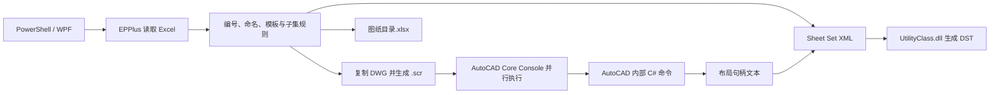
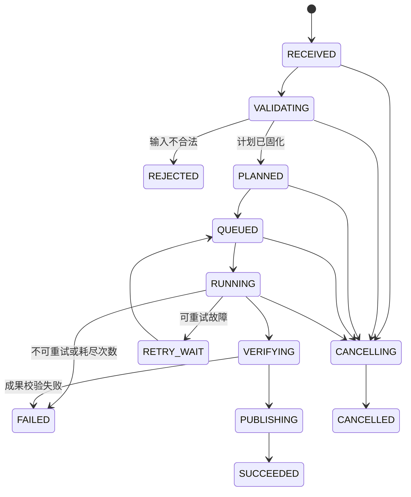
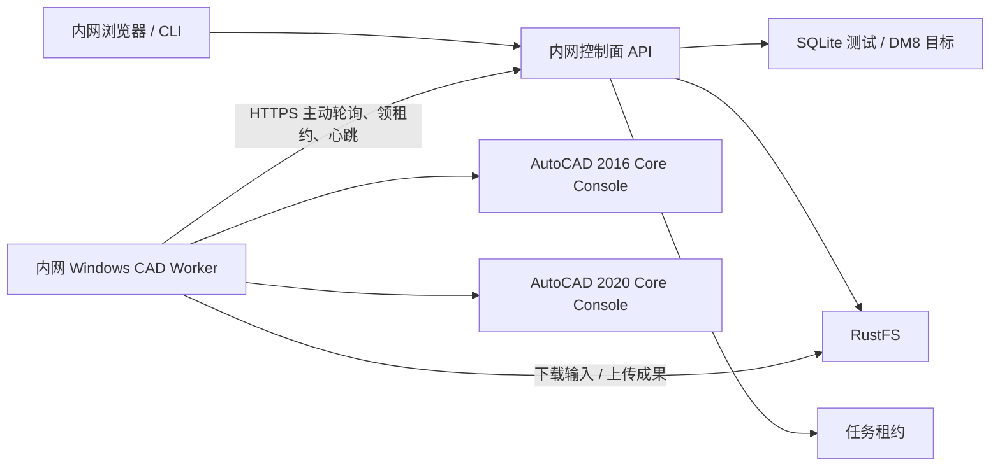
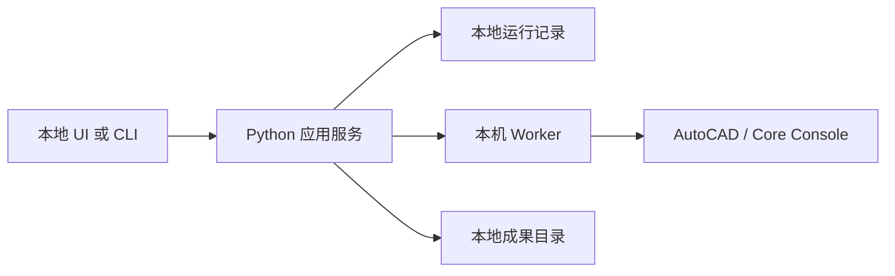

# 现代化 Python 重构架构设计（决策基线）

> 本架构已由 [ARCH-DB-001：DST Builder 绿地桌面架构基线](../../dst-builder/architecture/ARCH-DB-001-greenfield-desktop-baseline.md)取代。本文保留旧重构方向和决策背景，不构成 DST Builder 的运行时兼容、部署或实施承诺。

> 状态：最终定稿；ADR-001 至 ADR-020 已关闭
>
> 原则：本文只把仓库源码能够证明的事实作为现状条件；所有会改变产品行为、部署成本、许可证要求或数据安全边界的内容均已通过 ADR-001 至 ADR-020 获得用户确认。

## 1. 目标与非目标

### 1.1 目标

- 用现代 Python 重构现有 PowerShell/WPF 编排层。
- 同一套领域逻辑同时服务于本地运行和云端服务。
- 把 Excel、AutoCAD、DST、文件系统、用户界面和任务基础设施隔离在明确的适配器后面。
- 支持可恢复、可观测、可审计的长时间 CAD 任务。
- 通过黄金样本和分层测试证明迁移前后业务结果兼容。
- 允许 AutoCAD 执行后端按部署环境替换，而不污染业务规则。

### 1.2 已确认的非目标

- 不把 `pyautocad` 当作整个系统的基础框架。
- 不把必须运行在 AutoCAD 进程内的托管 API 代码强行改写为 Python。
- 不在没有黄金样本的情况下声称新旧 DWG 或 DST 等价。
- 不把现有“测试”按钮的输出视为自动化回归测试；该分支缺少完整句柄回填且只处理部分序号。

### 1.3 已确认的产品边界

- 采用混合模式：控制面部署在企业内网服务器，CAD 工作负载运行在企业内 Windows Worker。
- Python 负责业务编排、Web/API、Excel、任务、存储和审计；必须在 AutoCAD 内运行的能力继续使用 C#。
- 同时支持 AutoCAD 2016 和 AutoCAD 2020。
- 重构范围包含仓库中的全部 AutoCAD 插件，不只限于图纸集主链路。
- 本地采用与服务端共用的 Web UI，并提供 CLI。
- 面向单个组织内部多人使用，使用自建账号体系，并为未来 SSO 预留 OIDC 身份适配器。
- 图纸不得离开企业内网；业务文件要求永久保留，并要求操作审计和权限管理。
- 新系统产出与旧系统保持业务行为和成果语义一致，以真实项目作为黄金样本；本机具备 AutoCAD 2016 和 2020 集成测试环境。
- 服务部署在内网服务器；测试数据库使用 SQLite，数据访问层必须可迁移至达梦 DM8；对象存储使用现有 Docker RustFS。

### 1.4 已确认的部署前置条件

- 达梦 DM8 的目标版本、平台和兼容模式尚未确定；它是生产准入门槛，不阻塞架构设计。
- 独立内网备份服务器或 NAS 的具体地址后定；部署生产环境前必须提供，且不能与 RustFS 共用主机或磁盘。

## 2. 现状基线

当前主链路如下：



已确认的关键约束：

- 主编排器依赖 Windows PowerShell 5.1、WPF 和 Windows 文件系统行为。
- 当前配置指向 AutoCAD 2016 `accoreconsole.exe`。
- 本机已确认同时存在 AutoCAD 2016 和 AutoCAD 2020 的 `accoreconsole.exe`，可以建立双版本系统测试 Runner。
- DWG 处理依赖 AutoCAD 内部命令，包括布局清理、布局导入、句柄提取和电子签名参照插入。
- `AutoCad Utility.dll` 绑定 AutoCAD 2016 托管程序集，不能直接视为新版 AutoCAD 插件。
- Autodesk 的兼容矩阵要求 AutoCAD 2016 插件面向 .NET Framework 4.5、AutoCAD 2020 插件面向 .NET Framework 4.7；当前仓库混有 4.5 和 4.8 项目，必须按 AutoCAD 版本分别构建和测试。
- DST 当前由 `UtilityClass.dll` 在 XML 和 DST 之间转换。
- 主脚本的正式与测试处理器存在大量重复代码。
- 当前没有自动化测试；模板、字体、打印设置、AutoCAD 版本和 Excel 公式缓存均是运行环境的一部分。

## 3. 架构原则

### 3.1 依赖方向

采用六边形架构。依赖只能由外向内：

```text
界面 / API / Worker / CLI
          ↓
      应用用例层
          ↓
       领域核心
          ↑
端口接口 ← 基础设施适配器
```

- `domain` 不得导入 Web 框架、ORM、Pydantic、Excel、COM、AutoCAD 或文件系统代码。
- `application` 只协调领域对象和端口，不直接启动进程或读写工作簿。
- `infrastructure` 实现 Excel、任务存储、对象存储、Core Console、DST 和报告等端口。
- `interfaces` 负责 API、CLI、本地启动器和可选 UI，不包含命名或图纸展开规则。

### 3.2 单一业务流水线

本地、云端、测试预演和正式生成必须调用同一个 `GenerateSheetSet` 用例。差异通过显式请求参数和依赖注入表达，禁止复制处理器：

```text
接收请求
  → 固化输入快照
  → 解析并校验工作簿
  → 生成不可变项目计划
  → 准备隔离工作区
  → 生成 CAD 任务
  → 调度 CAD 后端
  → 校验 DWG / 布局 / Handle
  → 生成 DST 与目录
  → 校验成果清单
  → 原子发布成果
```

### 3.3 先计划、后执行

AutoCAD 启动前必须生成可序列化的 `GenerationPlan`。它包含全部输入摘要、推导规则结果、目标路径和 CAD 命令意图，可用于：

- `dry-run` 展示和人工复核；
- 幂等键计算；
- 任务重试；
- 新旧实现对比；
- 审计和故障复现。

### 3.4 工作区隔离与原子发布

- 每次运行使用独立 `run_id` 和工作区，不复用项目根目录中的 `temp/`。
- 处理中间文件不直接写入最终成果目录。
- 只有全部强制校验通过后才发布成果。
- 发布过程产生带时间和原因的版本，不沿用当前“移动顶层文件、保留未知子目录”的隐式备份语义，除非用户明确要求兼容该行为。
- 清理操作只能作用于已登记的运行工作区，不能使用宽泛通配符清理项目根目录。

## 4. 建议的 Python 包边界

下列目录表达职责，不预先决定 UI、数据库或队列产品：

```text
pyproject.toml
package.json
src/autocad_sheetset/
├─ domain/
│  ├─ models.py
│  ├─ value_objects.py
│  ├─ naming.py
│  ├─ expansion.py
│  ├─ template_rules.py
│  ├─ validation.py
│  ├─ events.py
│  └─ errors.py
├─ application/
│  ├─ commands.py
│  ├─ queries.py
│  ├─ generate_sheetset.py
│  ├─ validate_project.py
│  ├─ retry_run.py
│  ├─ cancel_run.py
│  ├─ ports/
│  │  ├─ project_input.py
│  │  ├─ cad_executor.py
│  │  ├─ sheetset_writer.py
│  │  ├─ artifact_store.py
│  │  ├─ run_repository.py
│  │  ├─ event_publisher.py
│  │  └─ clock.py
│  └─ services/
│     ├─ planner.py
│     ├─ runner.py
│     └─ publisher.py
├─ infrastructure/
│  ├─ excel/
│  ├─ config/
│  ├─ cad/
│  │  ├─ core_console.py
│  │  ├─ local_worker.py
│  │  └─ optional_backends/
│  ├─ sheetset/
│  ├─ persistence/
│  ├─ storage/
│  ├─ reporting/
│  └─ observability/
├─ interfaces/
│  ├─ api/
│  ├─ cli/
│  ├─ worker/
│  └─ desktop_or_local_web/
└─ bootstrap/
   ├─ local.py
   └─ service.py
tests/
├─ unit/
├─ contract/
├─ integration/
├─ golden_master/
└─ autocad_system/
web/
├─ src/
├─ tests/
└─ vite.config.ts
dotnet/
├─ Directory.Build.props
├─ SheetSet.BatchCommands/
├─ SetDataLink/
├─ SetViews/
├─ SetViewPort/
├─ Transform/
├─ CoordinateDimension/
├─ UtilityClass/
└─ tests/
```

目标仓库使用一个单体仓库管理 Python 控制面、Vue Web 前端和 C# AutoCAD 插件。三者独立构建、独立版本化，但由同一发布清单声明兼容组合。

## 5. 领域模型

### 5.1 聚合与值对象

| 类型 | 责任 | 关键约束 |
| --- | --- | --- |
| `ProjectInput` | 一次输入快照 | 原始文件摘要、解析版本、来源可追踪 |
| `SheetSetSpec` | 工程级属性 | 工程名称、阶段、专业、输出策略等 |
| `SheetGroupSpec` | Excel 中一行图纸分组 | 起始序号、张数、模板、图幅、人员属性 |
| `ExpandedSheet` | 展开后的单张图纸 | 全局唯一图号、确定布局名、所属 DWG |
| `TemplateRef` | 模板逻辑引用 | 类型、前缀、图幅和版本，不泄漏物理存储 |
| `CadDocumentPlan` | 一个输出 DWG 的执行计划 | 输入底板、目标布局、签名参照、预期 Handle 数 |
| `GenerationPlan` | 整次生成的不可变计划 | 计划版本、输入哈希、所有任务和成果清单 |
| `ArtifactManifest` | 成果及校验结果 | 文件哈希、类型、大小、产生阶段、关联任务 |

### 5.2 必须从旧代码提取并锁定的规则

- 图纸分组展开和起始序号连续性。
- 封面、扉页、送审版的布局选择。
- 单张与多张分组的 DWG 命名。
- 补零图号、布局名和中文分张后缀。
- SheetSet 全局人员属性与 Sheet 行级属性的回退。
- 默认基础 DWG、自定义基础 DWG和模板套件选择。
- 图纸集、子集、图纸、布局引用和自定义属性映射。
- 材料表、目录和其他伴随成果的生成条件。

所有规则都需要具名函数和表驱动测试，不允许散落在 API 路由、UI 事件或 CAD 命令拼接中。

### 5.3 持久化模型

数据库只保存元数据、状态、权限、审计和对象引用；大型文件全部存入 RustFS。

| 表组 | 核心表 | 责任 |
| --- | --- | --- |
| 身份 | `users`、`roles`、`user_roles`、`auth_sessions`、`access_tokens` | 自建账号、多角色、会话和可撤销令牌 |
| 权限 | `projects`、`project_members` | 工程归属和项目级角色绑定 |
| 录入 | `sheet_sets`、`project_drafts`、`draft_sheet_groups` | 可变草稿、稳定图纸 UUID、排序键和乐观锁版本 |
| 修订 | `project_revisions`、`revision_sheet_groups`、`number_change_maps` | 不可变修订、提交快照及旧→新图号映射 |
| 扩展字段 | `field_schemas`、`field_definitions`、`field_values` | 版本化自定义属性及 DST 映射 |
| 字典 | `dictionary_versions`、`dictionary_items` | 阶段、专业、代码、模板类型和图幅 |
| 模板与插件 | `template_packages`、`plugin_packages`、`compatibility_profiles` | 内容哈希、版本、AutoCAD 兼容矩阵和发布状态 |
| 资产 | `assets`、`asset_versions`、`asset_links` | RustFS 对象键、哈希、来源和软删除状态 |
| 任务 | `generation_runs`、`cad_tasks`、`task_attempts` | 运行、子任务、重试、状态和结果 |
| Worker | `worker_nodes`、`worker_capabilities`、`task_leases` | 机器身份、心跳、能力和任务租约 |
| 成果 | `artifact_manifests`、`artifact_items` | 最终和诊断成果、校验与下载权限 |
| 可靠事件 | `outbox_events` | 数据提交与事件发布的一致性 |
| 审计 | `audit_events` | 只追加的操作者、对象、动作、前后摘要和关联请求 |

关键数据库约束：

- 业务 ID 使用 UUID，数据库中保存为 `CHAR(36)`，避免 SQLite 与 DM8 原生 UUID 差异。
- 所有时间由应用层转换为 UTC；UI 按香港时区显示。
- 状态和枚举使用受检查的 `VARCHAR`，不依赖数据库原生 ENUM。
- 可变记录带整数 `version`；更新使用 `WHERE id = ? AND version = ?` 实现乐观锁。
- 不可变修订保存规范化字段和 canonical JSON/CLOB 快照，快照带 schema 版本和 SHA-256。
- 不依赖 SQLite 特有 UPSERT、部分索引、无类型列或 DM8 专有 SQL；方言差异只存在于基础设施层。
- 审计事件与业务变更在同一数据库事务写入；外部通知使用 Transactional Outbox，禁止先发事件再提交数据。

### 5.4 聚合一致性边界

- `ProjectDraft` 是编辑事务边界；保存一批网格变更时一次提交并增加版本。
- `ProjectRevision` 创建后不可更新，纠错必须产生新修订。
- `GenerationRun` 只引用一个不可变修订、一个模板包和一个插件兼容配置。
- `CadTask` 的租约领取使用条件更新，保证同一时刻最多一个 Worker 持有有效租约。
- `ArtifactManifest` 只有在全部必需对象上传、哈希验证和语义校验通过后才能标记为 `published`。

## 6. 端口与适配器契约

### 6.1 输入端口

`ProjectInputReader`：

- 读取工作簿为无框架领域 DTO；
- 返回公式值来源和缓存状态诊断；
- Excel 已调整为兼容导入来源，不再是目标系统的事实源；公式字段在导入时转换为后端确定性派生值。完整录入边界登记为 ADR-019。

`TemplateCatalog`：

- 根据逻辑模板引用解析实际文件；
- 计算内容哈希和版本；
- 验证同一套模板的文件完整性；
- 本地目录、对象存储或受管模板库使用同一契约。

### 6.2 CAD 执行端口

`CadExecutor` 的输入和输出必须与具体后端无关：

```text
submit(CadDocumentPlan) -> CadTaskId
status(CadTaskId) -> CadTaskStatus
cancel(CadTaskId) -> CancelResult
collect(CadTaskId) -> CadExecutionResult
```

`CadExecutionResult` 至少包含：

- 后端与 AutoCAD/插件版本；
- 输入、模板和输出哈希；
- 退出码、标准输出、标准错误和耗时；
- 实际布局清单及 Handle；
- 警告、错误分类和可重试性；
- 产生的成果清单。

本次目标实现包含：

- 本机 Core Console 适配器；
- 企业内 Windows Worker 适配器。

云外 Windows Worker 和 Autodesk APS Design Automation 不进入当前目标，因为用户已确认文件不得离开企业内网。

### 6.3 Sheet Set 端口

`SheetSetWriter` 接收纯领域 `SheetSetDocument`，输出 DST 和结构化检查结果。可存在多个契约实现：

- 旧 `UtilityClass.dll` 兼容适配器；
- Sheet Set Object COM 适配器；
- 其他经过 Autodesk 支持且由黄金样本验证的实现。

DST 生成器不得自行读取 Excel，也不得推导命名规则。

### 6.4 存储与运行记录端口

- `ArtifactStore`：保存输入快照、中间件、日志和最终成果。
- `RunRepository`：持久化运行状态和乐观锁版本。
- `EventPublisher`：发布状态变化；本地可为进程内实现，云端可映射到队列或事件系统。
- `SecretProvider`：提供服务凭证；任何密钥不得进入工作簿、配置仓库或任务载荷。

## 7. 任务状态机



约束：

- 状态迁移必须由应用服务完成并记录原因。
- 同一 `plan_hash + backend_profile + template_version` 的请求支持幂等处理。
- CAD 子任务可独立重试，但最终发布只执行一次。
- 取消是协作式操作；若底层进程无法安全中断，先标记取消请求，再由 Worker 完成进程回收和工作区隔离。
- 进程崩溃后可依据租约和心跳识别遗留任务。

## 8. 本地与云端的统一边界

无论最终选择哪种产品形态，以下核心保持一致：

| 能力 | 本地模式 | 服务模式 |
| --- | --- | --- |
| 领域与应用包 | 同一 Python 包 | 同一 Python 包 |
| 请求模型 | 同一命令对象 | 同一命令对象 |
| 运行状态 | 本地持久化适配器 | 服务持久化适配器 |
| CAD 执行 | 经 `CadExecutor` | 经 `CadExecutor` |
| 文件保存 | 本地 ArtifactStore | 服务 ArtifactStore |
| 日志字段 | 同一结构 | 同一结构并集中采集 |
| 配置结构 | 同一 Settings 模型 | 同一 Settings 模型，来源不同 |

已确认的部署拓扑：

### 8.1 内网混合服务拓扑



控制面不主动连接 Worker。Worker 使用独立机器凭证主动领取与自身能力标签匹配的任务，例如 `autocad=2016`、`autocad=2020`、`plugin_bundle=<version>`。数据库中的任务租约、租约到期时间和 Worker 心跳用于故障恢复。

第一阶段不引入 Celery：其 Windows Worker 支持边界与本项目的 AutoCAD 进程模型不匹配，而且单组织内网场景可以用数据库租约和 HTTPS 拉取减少基础设施。独立消息中间件是否需要加入，由容量数据和故障注入测试决定。

### 8.2 全本地独立拓扑



本地启动器在回环地址启动同一 FastAPI 应用，并打开同一 Vue Web UI；CLI 直接调用应用用例。控制面断开时仍能完整离线生成和管理本地项目；本地与服务端不做自动双向同步，只支持显式导入或上传。

### 8.3 文件流与信任边界

- 浏览器只通过控制面访问元数据和受控下载接口，不直接持有 RustFS 管理凭证。
- 控制面签发短期、限定对象键和操作的 RustFS 访问能力，或由控制面代理小文件上传下载。
- Worker 只能访问租约任务对应的对象前缀，不能枚举其他项目。
- 输入、模板、插件包、中间结果和最终成果均留在企业内网。
- RustFS 对象键使用组织、项目、运行和成果标识构造，不使用用户原始路径。
- 最终成果永久策略与版本控制在 RustFS 和业务元数据两层同时表达；业务文件只允许可恢复的软删除，不提供物理删除入口。

## 9. API 与交互契约基线

本地 Web UI、CLI、内网服务和 Windows Worker 共用版本化 HTTP API；CLI 在纯本地进程模式下也可直接调用同一用例层：

- 创建输入上传或登记输入引用；
- 校验输入并返回字段级问题；
- 创建预演计划；
- 提交生成任务；
- 查询运行、阶段和子任务；
- 请求取消或重试；
- 获取日志与诊断包；
- 获取成果清单并下载成果；
- 查询后端、模板和能力版本。

长任务不能由单个同步 HTTP 请求持有到完成。Web 进度第一阶段使用 Server-Sent Events，并保留轮询兜底；Worker 使用带租约的主动轮询，不用浏览器实时通道。

### 9.1 Web 数据录入建议

对五个真实输入工作簿的只读分析表明，现有输入稳定分为三块：

- `SheetSet`：23 行工程级键值属性；
- `Sheet`：12 列图纸分组表；
- `Config`：设计阶段、专业与代码、模板类型、图幅等字典。

真实样本还存在以下问题：

- `专业代码` 的 `VLOOKUP` 已出现 `#NAME?`；
- `是否送审版` 和后续 `起始序号` 依赖公式及已保存的缓存值；
- `基础模板` 和签名参照使用录入电脑的绝对路径；
- `子项名2` 与 `子项名（路段）` 等字段名称存在历史漂移；
- Excel 无法可靠表达权限、版本、协作、审计和资产生命周期。

因此目标不是把单元格机械搬到浏览器，而是建立以下数据录入模型。

#### 9.1.1 工程信息表单

- 固定核心字段：工程名称、设计号、设计阶段、版本、日期、册信息、建设单位、专业和人员角色。
- 派生字段：专业代码由专业字典计算；送审状态由明确版本规则计算并展示来源。
- 扩展属性：通过版本化 `FieldDefinition` 配置，并显式声明是否写入 DST、自定义属性名称、数据类型、必填性和可选值。
- 服务模式不把 Windows `图纸保存路径` 当作业务字段；成果由 ArtifactStore 管理，另行提供导出策略。
- 一个工程可包含多个专业、分册或图纸集；每个图纸集独立生成 DST，但共享工程信息、人员和受控资产。

#### 9.1.2 图纸分组数据网格

保留接近电子表格的高密度编辑体验：

- 支持整行新增、复制、删除、拖动排序和多行批量操作；
- 支持从 Excel/CSV 复制多单元格后直接粘贴到网格；
- 提供图名、张数、图幅、比例、模板类型、人员覆盖、基础 DWG、签名参照和备注；
- 项目级人员为默认值，行级人员只在“高级覆盖”中编辑；
- 普通图纸起始序号由顺序和张数自动推导，封面/扉页使用显式“不编号”策略；
- 图纸分组使用稳定 UUID 和独立排序键，图号不是数据库主键；插入、删除或拖动后可重新计算序列而不破坏审计关联；
- 草稿插入或删除后立即紧凑重排后续图号；已经发布的修订和成果保持不变，新修订重排并生成“旧图号 → 新图号”影响清单，必须由项目管理员确认后才能提交；
- 右侧实时展示展开后的图纸、布局名、图号、DWG 文件名和校验问题；
- 所有派生值由后端领域规则计算，前端只展示，不复制规则。

#### 9.1.3 字典与模板管理

- 设计阶段、专业代码、图幅和模板类型从 Excel `Config` 迁移为数据库字典。
- 模板管理员维护字典、字段 schema、模板套件和适用 AutoCAD 版本。
- 已提交项目引用不可变字典/模板版本；后续修改不追溯改变历史项目。

#### 9.1.4 草稿、快照与审计

- 编辑对象为可变 `ProjectDraft`，使用乐观锁防止静默覆盖。
- 多人可以编辑同一草稿，但不实现实时光标或无冲突协同编辑；发生版本冲突时必须重新加载并人工合并。
- 每次保存记录操作者、时间、字段差异和版本号。
- 用户可以同时具有多个角色；项目管理员审核草稿，审核通过后冻结为不可变 `ProjectRevision`，生成计划只引用该快照。
- 修改已提交项目必须创建新修订，旧修订和成果永久保留。
- 草稿中的删除为可审计删除；数据库保留变更历史。已经发布的修订永不原地删除或重写。

#### 9.1.5 Excel 兼容桥

建议保留 Excel 导入/导出，但把它降级为兼容与批量交换能力，而不是系统事实源：

- 导入旧 Excel 后先生成草稿和完整问题清单，不直接启动 CAD；
- 保存原始工作簿及其哈希，满足追溯；
- 导入时把绝对文件路径解析为待上传/待映射资产，不信任客户端路径；
- 可导出当前项目修订为兼容旧格式的 Excel，用于线下审阅或紧急回退；
- Web 表单、Excel 导入和 API 创建最终都生成同一个 `ProjectDraft` 命令模型。

#### 9.1.6 资产和成果交付

- 浏览器上传的基础 DWG、电子签名参照和其他输入资产永久快照到 RustFS。
- 可从管理员登记的内网共享目录导入文件，但导入完成后仍复制到 RustFS，并记录来源路径和内容哈希。
- 服务端成果支持单文件下载、按修订打包下载及导出到管理员登记的内网共享目录。
- 本地离线模式在运行时选择本地输出目录，不把机器路径写成工程业务属性。
- 图纸分组网格支持多单元格粘贴、拖动、复制、批量设置和派生成果实时预览。

### 9.2 HTTP API 清单

统一前缀为 `/api/v1`。浏览器、CLI 和 Worker 使用同一领域命令，但 Worker 使用独立机器认证域。

| 资源 | 关键端点 | 说明 |
| --- | --- | --- |
| 认证 | `POST /auth/login`、`POST /auth/logout`、`GET /auth/me` | 会话创建、撤销和当前权限 |
| 用户 | `GET/POST /users`、`PATCH /users/{id}` | 系统管理员管理账号和状态 |
| 工程 | `GET/POST /projects`、`GET/PATCH /projects/{id}` | 工程元数据和成员范围 |
| 成员 | `GET/PUT /projects/{id}/members` | 项目级角色绑定 |
| 图纸集 | `GET/POST /projects/{id}/sheet-sets` | 一个工程下的多专业/分册图纸集 |
| 草稿 | `GET/PUT /sheet-sets/{id}/draft` | 整体保存，要求 `If-Match` 草稿版本 |
| 网格 | `POST /drafts/{id}/sheet-groups:batch` | 插入、删除、排序、复制和批量粘贴的原子命令 |
| 校验 | `POST /drafts/{id}:validate` | 返回字段级错误、警告和派生预览 |
| 审核 | `POST /drafts/{id}:submit`、`POST /drafts/{id}:approve`、`POST /drafts/{id}:reject` | 提交、管理员审核和不可变修订生成 |
| 修订 | `GET /sheet-sets/{id}/revisions`、`GET /revisions/{id}` | 修订、图号映射和历史成果 |
| Excel | `POST /imports/excel`、`GET /revisions/{id}/export.xlsx` | 兼容导入和旧格式导出 |
| 资产 | `POST /assets/uploads`、`POST /assets:import-share`、`GET /assets/{id}` | 分片上传、共享目录导入和元数据 |
| 运行 | `POST /revisions/{id}/runs`、`GET /runs/{id}` | 幂等提交和状态查询 |
| 控制 | `POST /runs/{id}:cancel`、`POST /runs/{id}:retry` | 协作式取消和失败任务重试 |
| 进度 | `GET /runs/{id}/events` | SSE；断线后用事件序号续传 |
| 成果 | `GET /runs/{id}/artifacts`、`POST /artifacts/{id}:export-share` | 清单、受控下载和共享目录导出 |
| 模板 | `GET/POST /template-packages`、`POST /template-packages/{id}:publish` | 版本化上传、校验和发布 |
| 字典 | `GET/POST /dictionary-versions`、`POST /dictionary-versions/{id}:publish` | 字典草稿和不可变发布 |
| Worker | `POST /workers/register`、`POST /workers/{id}/heartbeat` | 注册、能力和健康状态 |
| 租约 | `POST /worker-tasks:claim`、`POST /worker-tasks/{id}:renew`、`POST /worker-tasks/{id}:complete` | 主动领取、续租和提交结果 |
| 审计 | `GET /audit-events` | 审计员和系统管理员只读查询 |

### 9.3 API 一致性规则

- 写接口接收 `Idempotency-Key`；相同用户、端点和键返回原响应，不重复创建运行或修订。
- 可变资源返回 `ETag`；更新必须携带 `If-Match`，版本不一致返回 `409 DRAFT_VERSION_CONFLICT`。
- 列表使用稳定游标分页，不使用大偏移分页。
- 错误采用 `application/problem+json`，至少包含 `code`、`title`、`detail`、`request_id` 和字段问题列表。
- Worker 完成任务时同时提交结果摘要和成果哈希；服务端验证 RustFS 对象后才接受完成状态。
- 大文件使用 S3 multipart upload；浏览器不获得 RustFS 管理凭证，只取得短期、单对象、单操作能力。
- 所有公开 schema 生成 OpenAPI，并以契约测试阻止不兼容变更。

## 10. 配置、版本和兼容性

### 10.1 技术栈定稿基线

| 层 | 选择 | 理由与边界 |
| --- | --- | --- |
| Python | CPython 3.12 x64 | 达梦官方在线驱动支持到 Python 3.12；兼顾稳定生态和 Windows Worker |
| 包与环境 | `uv` + `pyproject.toml` | 锁定跨 Windows/Linux 依赖；达梦驱动作为目标环境专用扩展安装 |
| API | FastAPI + Pydantic 2 | 同时满足内部 HTTP API、OpenAPI、SSE 和结构化校验 |
| Web UI | Vue 3 + TypeScript + Vite | 一套 UI 同时用于本地回环服务和内网控制面 |
| 数据访问 | SQLAlchemy 2 + Alembic | 通过 Repository 隔离 SQLite 和 DM8；不向领域层泄漏 ORM |
| 测试数据库 | SQLite | 仅用于开发、单元和轻量集成测试，不作为生产并发能力证明 |
| 目标数据库 | 达梦 DM8 + `dmPython` + `sqlalchemy_dm` 2.x | 官方存在 SQLAlchemy 2.0 方言；必须针对目标 DM8 安装包做迁移和事务契约测试 |
| 对象存储 | RustFS + `boto3` S3 API | 使用标准 S3 端口，避免绑定 RustFS 私有实现 |
| Worker 通信 | HTTPS 拉取 + 数据库任务租约 | Windows Worker 只需出向连接；支持心跳、租约过期和能力路由 |
| 本地模式 | FastAPI 回环服务 + 同一 Vue UI + CLI | 最大化复用，避免 PySide6 与 Web 双前端 |
| C# 插件 | SDK 风格项目，AutoCAD 版本化构建 | AutoCAD 2016 和 2020 分别引用对应 Managed SDK 并生成独立包 |
| 日志 | 标准 `logging` + JSON formatter | 控制面与 Worker 使用同一字段契约，可输出文件或集中日志系统 |
| 测试 | pytest + Playwright + .NET 测试 + AutoCAD 系统 Runner | 覆盖领域、API、Web、插件纯逻辑和真实 CAD 行为 |

依赖版本在实施时通过锁文件固定，不在架构文档中写死补丁版本。任何升级都必须经过 SQLite、DM8、AutoCAD 2016 和 AutoCAD 2020 的兼容流水线。

### 10.2 配置分类

配置分为四类：

- 应用配置：日志、超时、并发、重试和工作区根目录。
- 后端配置：AutoCAD 路径、插件包、执行能力和许可证标签。
- 模板配置：模板套件版本、内容哈希和兼容的 AutoCAD 范围。
- 秘密配置：数据库、对象存储、身份系统和队列凭证。

### 10.3 版本指纹

每个任务记录以下版本指纹：

- 应用版本与 Git 提交；
- 领域计划 schema 版本；
- Excel 输入 schema 版本；
- AutoCAD 版本；
- CAD 插件包版本；
- DST 适配器版本；
- 模板套件版本与哈希。

旧 `config.ini` 只作为迁移输入。目标配置使用带 schema 的 TOML 文件；环境变量覆盖只用于部署差异和秘密引用。配置加载顺序固定为“内置默认值 → 配置文件 → 环境变量 → 显式命令参数”，并在启动时输出脱敏后的有效配置摘要。

### 10.4 AutoCAD 插件版本矩阵

| 目标 | AutoCAD Release | 插件目标框架 | 构建引用 | 发布标签 |
| --- | --- | --- | --- | --- |
| AutoCAD 2016 | R20.1 | .NET Framework 4.5、x64 | AutoCAD 2016 Managed SDK | `acad2016-r20.1` |
| AutoCAD 2020 | R23.1 | .NET Framework 4.7、x64 | AutoCAD 2020 Managed SDK | `acad2020-r23.1` |

- 同一业务源码通过共享项目或链接源码复用，但每个 AutoCAD 版本单独编译、签名、测试和打包。
- 构建不得从个人 `.csproj.user` 或硬编码安装路径解析 SDK；CI 和开发机通过显式 MSBuild 属性提供 SDK 根目录。
- 批处理命令和交互式命令分程序集，避免 Core Console 加载 WPF/WinForms 等无关 UI 依赖。
- Worker 注册时上报已安装 AutoCAD、插件包、模板和字体能力；调度器只分派完全匹配的计划。

### 10.5 插件现代化矩阵

| 现有项目/命令 | 目标组件 | 运行形态 | 重构要求 |
| --- | --- | --- | --- |
| `AutoCad Utility`：`GetLayoutHandles`、`Ainsert`、`dellayouts` | `SheetSet.BatchCommands` | Core Console | 无 UI、结构化参数/结果、确定退出状态、双 AutoCAD 构建 |
| `AutoCad Utility`：`BindXrefs`、`FTT`、`FTTA`、`clearxref` | `CadTools.Interactive` | AutoCAD 桌面 | 保留交互语义，业务操作抽到可测试服务 |
| `SetDataLink` | `CadTools.SetDataLink` | AutoCAD 桌面 | 参数模型与 UI 分离；文件、工作表和范围校验 |
| `SetViews` | `CadTools.SetViews` | AutoCAD 桌面 | 视图编号和状态逻辑抽出；数据库事务边界明确 |
| `SetViewPort` | `CadTools.SetViewPort` | AutoCAD 桌面 | 合并 `0.1` 历史副本；比例计算移入纯类库 |
| `Transform`：`CoT`、`UcoT` | `CadTools.Transform` | AutoCAD 桌面 | 四参数模型和值对象化；正反转换互逆测试 |
| `CoordinateDimension`：`ZBA`、`ZB`、`ZBH` | `CadTools.CoordinateDimension` | AutoCAD 桌面 | Jig、设置窗口和几何计算分层；几何核心单元测试 |
| `UtilityClass`：分组/INI | Python 领域与配置层 | Python | 删除重复 .NET 实现，迁移规则并做黄金测试 |
| `UtilityClass`：DST/XML | `LegacySheetSetWriter` → `SsoSheetSetWriter` | Windows Worker | 先兼容旧输出，再使用 Sheet Set Object 模型替代 |

每个 AutoCAD 版本发布独立 `.bundle`，包含 `PackageContents.xml`、目标 DLL、配置 schema、版本清单和 SHA-256。交互插件按 AutoCAD 版本安装到受信任的 `ApplicationPlugins` 目录；Worker 仅安装批处理包和 DST 适配器。

### 10.6 DST 执行边界

DST 生成不能放在 Linux 控制面。`SheetSetWriter` 作为 Windows Worker 能力执行：

1. 第一阶段通过兼容适配器调用现有 `UtilityClass`，确保旧样本一致。
2. 同期构建 SSO COM POC，验证 AutoCAD 2016/2020 的创建、锁定、属性和布局引用。
3. POC 通过全部黄金样本后切换到 `SsoSheetSetWriter`；旧实现至少保留一个稳定发布周期作为回滚。
4. 控制面只接收领域 `SheetSetDocument` 和结果清单，不处理 DST 二进制格式。

## 11. 安全与隔离基线

以下要求不依赖最终是否多租户：

- 上传文件按内容、扩展名、大小和压缩炸弹风险校验。
- 用户提供的文件名不能直接参与服务器路径拼接。
- CAD Worker 使用低权限专用账户和隔离工作区。
- CAD 命令必须从结构化意图渲染，禁止把工作簿文本直接拼接为任意 `.scr` 命令。
- 日志默认不记录凭证、完整敏感路径或工作簿全部内容。
- 下载使用成果清单中的受控标识，不接受任意路径。
- 工作区清理使用登记清单并限制在已验证根目录内。
- 输入、模板、插件和成果均计算哈希，保证可追溯性。

系统使用自建账号认证，并在身份端口预留 OIDC。密码只能保存 Argon2id 哈希；浏览器使用 `HttpOnly`、`SameSite` 会话 Cookie 和 CSRF 防护，Worker/CLI 使用可轮换的机器或个人令牌。业务文件不做应用层静态加密；永久文件只允许软删除和恢复。

### 11.1 RBAC 权限矩阵

用户可以同时拥有多个角色，最终权限取角色并集；系统管理员不能通过普通业务接口绕过审计。

| 能力 | 系统管理员 | 模板管理员 | 项目管理员 | 操作员 | 查看者 | 审计员 |
| --- | --- | --- | --- | --- | --- | --- |
| 用户和系统配置 | 管理 | — | — | — | — | 只读审计 |
| Worker 和机器令牌 | 管理 | 查看兼容性 | — | — | — | 只读审计 |
| 模板/插件/字典 | 管理 | 创建、校验、发布 | 使用 | 使用 | 查看版本 | 只读审计 |
| 创建工程 | 允许 | — | 允许 | 按项目授权 | — | — |
| 项目成员 | 管理 | — | 管理本项目 | — | — | 只读审计 |
| 编辑草稿 | 按项目角色 | — | 允许 | 允许 | 只读 | 只读审计 |
| 审核修订 | 按项目角色 | — | 允许 | — | — | 只读审计 |
| 创建/取消/重试任务 | 按项目角色 | — | 允许 | 允许 | — | 只读审计 |
| 查看/下载成果 | 按项目角色 | — | 允许 | 允许 | 允许 | 只读审计 |
| 软删除/恢复业务文件 | 管理 | 模板范围 | 项目范围 | — | — | 只读审计 |
| 查询全局审计 | 允许 | 自身行为 | 项目范围 | 自身行为 | — | 允许 |

`项目管理员`、`操作员`、`查看者` 是项目级绑定；其他角色是组织级绑定。下载、共享目录导出、审核、模板发布、角色变更和令牌操作必须形成高优先级审计事件。

### 11.2 认证与令牌生命周期

- 初始管理员通过一次性引导命令创建，首次登录强制改密。
- 密码策略、失败锁定和会话最大期限由系统配置管理；重置密码撤销全部会话。
- 浏览器会话使用服务端可撤销会话 ID，不把长期 JWT 放入浏览器存储。
- CLI 个人令牌只显示一次、保存哈希、设置到期时间和最小权限范围。
- Worker 使用机器令牌；吊销后无法续租，新任务不再分配，正在运行任务按策略取消或隔离。
- OIDC 适配器未来只负责认证和账号映射，项目授权继续由本系统 RBAC 决定。

### 11.3 审计事件

审计内容包含 `event_id`、UTC 时间、操作者或机器、来源 IP、请求 ID、动作、目标、结果、修订/运行关联、前后值摘要和失败代码。密码、令牌、RustFS 密钥和大型文件内容不进入审计。审计表只追加，应用无更新和删除接口。

## 12. 可观测性与故障模型

### 12.1 结构化上下文

每条日志或指标至少关联：

- `run_id`、`project_id`、`cad_task_id`；
- 阶段和状态；
- 后端、AutoCAD 和插件版本；
- 尝试次数；
- 错误代码，而不只是一段自由文本。

### 12.2 错误分类

- 输入错误：字段、编号、资产引用、字典和模板选择。
- 能力错误：Worker 不支持所需 AutoCAD/插件/模板版本。
- 环境错误：许可证、字体、打印机、磁盘空间和权限。
- CAD 执行错误：进程启动、超时、崩溃、命令失败。
- 成果错误：布局、Handle、DST 引用或文件清单不一致。
- 基础设施错误：数据库、队列、对象存储或网络故障。

重试策略按错误代码配置。输入错误和确定性成果错误不能自动重试；瞬时基础设施错误可以指数退避重试。

### 12.3 稳定错误码

| 类别 | 代表错误码 | 自动重试 |
| --- | --- | --- |
| 输入 | `INPUT_REQUIRED`、`NUMBERING_INVALID`、`ASSET_UNRESOLVED` | 否 |
| 并发 | `DRAFT_VERSION_CONFLICT`、`REVISION_ALREADY_APPROVED` | 否 |
| 权限 | `AUTH_REQUIRED`、`PERMISSION_DENIED`、`TOKEN_REVOKED` | 否 |
| 能力 | `NO_CAPABLE_WORKER`、`PLUGIN_VERSION_MISMATCH`、`TEMPLATE_INCOMPATIBLE` | 等待能力上线 |
| CAD | `CAD_START_FAILED`、`CAD_TIMEOUT`、`CAD_PROCESS_CRASHED` | 按次数有限重试 |
| 成果 | `LAYOUT_MISMATCH`、`HANDLE_MISMATCH`、`DST_REFERENCE_INVALID` | 否，需诊断 |
| 存储 | `RUSTFS_UNAVAILABLE`、`ARTIFACT_HASH_MISMATCH` | 前者重试，后者否 |
| 数据库 | `DATABASE_UNAVAILABLE`、`LEASE_CONFLICT` | 瞬时重试 |
| 取消 | `CANCEL_REQUESTED`、`CANCEL_TIMEOUT` | 否 |

错误码属于 API 契约。用户界面负责本地化文案，日志和审计始终保存稳定代码。

### 12.4 指标与健康检查

- HTTP：请求量、延迟、状态码、活跃会话和限流次数。
- 任务：排队时间、运行时间、成功率、重试率、取消率和按错误码失败量。
- Worker：心跳年龄、租约数、AutoCAD 版本、可用槽位、进程泄漏和工作区磁盘。
- CAD：Core Console 启动耗时、单 DWG 耗时、超时、退出码和布局数差异。
- 存储：上传下载吞吐、失败、对象校验、桶容量和软删除量。
- 数据库：连接池、事务失败、慢查询、迁移版本和 Outbox 积压。

提供三类端点：`/health/live` 只判断进程存活；`/health/ready` 验证数据库和必要配置；`/health/dependencies` 为管理员显示 RustFS、Worker 和版本兼容状态。Worker 失联不会令控制面不健康，但会阻止新 CAD 任务并产生告警。

### 12.5 已确认容量基线

- 50 个注册用户、20 个同时在线用户。
- 最多 5 个同时生成项目、每日 30 个项目。
- 单项目输入上限 10 GB、单文件上限 2 GB，使用 S3 分片上传。
- API 与文件传输分离，避免大文件占用应用进程内存。
- 调度器按 Worker 实测槽位、AutoCAD 版本和磁盘空间分派；旧配置中的并发数 10 不直接继承。
- 初始不引入 Redis/RabbitMQ；数据库租约在以上规模完成压力与故障测试后才准入。若任务领取成为瓶颈，再保持端口不变替换为消息适配器。

## 13. 测试与验收体系

### 13.1 单元测试

不启动 AutoCAD，覆盖：

- 所有命名和编号边界；
- 图纸分组展开；
- 模板与布局选择；
- 人员属性回退；
- 输入错误聚合；
- 计划幂等性；
- 状态机和重试判定。

### 13.2 契约测试

每个适配器共享同一套端口契约测试，例如所有 `ArtifactStore` 必须通过路径隔离、哈希和原子发布测试。

### 13.3 黄金样本测试

至少需要：

1. 图纸目录加单张通用图；
2. 一个 DWG 内含多个布局；
3. 封面、扉页和送审封面；
4. 同名图纸和中文分张后缀；
5. 自定义基础 DWG；
6. 电子签名参照；
7. 非法输入和中途失败样本。

比较项不应只看文件哈希，因为 DWG/DST 可能包含非业务时间戳或内部标识。需要建立语义比较器，核对：

- 文件和目录清单；
- DWG 布局名、顺序、Handle 关联和关键对象；
- 图号、标题和自定义属性；
- DST 层次、引用和属性；
- 图纸目录单元格值；
- 可接受的警告和耗时基线。

### 13.4 AutoCAD 系统测试

在带对应 AutoCAD 和许可证的专用 Windows Runner 上串行或受控并行运行。版本矩阵必须由用户确认的支持范围生成，不能用单一版本通过来证明全部版本兼容。

## 14. 分阶段迁移方案

每个阶段都可回滚到旧链路，不进行一次性切换。

### 阶段 0：冻结行为与建立黄金样本

- 修复测试所需的仓库配置缺口，但不改变业务规则。
- 保存输入、模板、插件、环境指纹和完整输出。
- 建立语义检查清单和人工签字基线。

退出条件：至少六类成功样本和关键失败样本可重复执行。

### 阶段 1：建立 Python 骨架和纯领域核心

- 创建 Python 包、静态检查、测试和构建基线。
- 实现工程/分册/草稿/修订领域模型、验证、展开、编号、命名和计划生成。
- 实现 Excel 兼容导入器，把旧输入转换为统一草稿命令。
- 建立 SQLite Repository 和数据库方言契约测试。
- Python 输出计划，与 PowerShell 中间结果进行差异比较。

退出条件：黄金样本的全部计划字段一致，边界规则有单元测试。

### 阶段 2：封装旧 CAD 与 DST 链路

- 实现 Core Console 兼容适配器。
- 先复用经过版本确认的 C# 命令和 DST 转换实现。
- 引入独立工作区、结构化日志、超时、进程回收和成果清单。

退出条件：Python 编排产生的成果通过黄金样本语义比较。

### 阶段 3：提供本地产品形态

- 实现 FastAPI 回环服务、统一 Vue Web UI 和 CLI。
- 实现工程表单、图纸网格、批量粘贴、实时预览、插入/删除重排和修订审批。
- 增加安装、升级、环境诊断和诊断包导出。
- 进行双轨运行，旧 PowerShell 保留为可回滚入口。

退出条件：真实项目试运行通过，运维手册和回滚演练完成。

### 阶段 4：现代化 AutoCAD 与 DST 适配器

- 按确认的 AutoCAD 版本矩阵构建插件包。
- 现代化主链路和全部五组交互式插件，拆分批处理、UI 与纯计算类库。
- 用 SDK 风格 C# 项目、明确的命令契约、`.bundle` 和版本化发布替代旧二进制投放。
- 评估并验证 Sheet Set Object 适配器，避免无支持的 DST 直接修改方式。

退出条件：各受支持 AutoCAD 版本均通过系统测试矩阵。

### 阶段 5：服务化控制面

- 根据已确认的用户模型加入身份、授权、项目、配额和审计。
- 引入持久化运行记录、Worker 注册、数据库租约、RustFS 成果存储和共享目录导出。
- 完成 Linux Docker Compose、Windows Service Worker、备份恢复和监控告警。
- 本地模式继续使用同一应用核心和端口契约。

退出条件：故障注入、容量、安全、备份恢复和数据生命周期测试通过。

### 阶段 6：切换与退役

- 逐项目或逐团队灰度。
- 对比失败时自动保留新旧诊断包。
- 达到约定观察期后才退役 PowerShell 编排器和过渡适配器。

### 14.1 粗略工作量与团队

以下是架构级估算，不是固定工期；以 2–3 名开发人员加兼职测试/运维为基线：

| 阶段 | 估算日历时间 | 主要角色 |
| --- | --- | --- |
| 0 黄金样本 | 1–2 周 | CAD 专家、测试 |
| 1 领域核心与数据 | 4–6 周 | Python、测试 |
| 2 CAD/DST 兼容适配 | 4–6 周 | Python、CAD/.NET |
| 3 本地 Web 产品 | 5–7 周 | 前端、Python、测试 |
| 4 全插件双版本现代化 | 8–12 周 | CAD/.NET、测试 |
| 5 内网服务化 | 7–10 周 | Python、前端、运维、安全 |
| 6 灰度与退役 | 3–4 周 | 全团队、业务验收 |

部分阶段可重叠；建议整体预留 8–11 个月，包括真实项目试运行、AutoCAD 双版本问题修复和 DM8 准入测试。团队至少需要一名能够解释现有图纸规则和模板的业务/CAD 负责人，否则黄金样本只能证明技术运行，不能证明业务一致。

### 14.2 回滚层级

- 计划级：新领域计划与旧 PowerShell 计划不一致时，不启动 CAD。
- 运行级：新任务失败时保留完整诊断，不发布部分成果，可用同一输入回退旧链路。
- 适配器级：Core Console、DST Writer 和存储都通过端口切回上一稳定实现。
- 发布级：Docker 镜像、Python 包、Web 静态资源和插件包使用同一发布清单，可整体回滚。
- 数据级：数据库迁移遵循 expand/migrate/contract；灰度期不执行不可逆列删除。
- 产品级：PowerShell 入口至少保留两个通过验收的稳定发布周期，之后只读归档源码与二进制。

## 15. 部署、发布与运维

### 15.1 Linux 控制面部署单元

Docker Compose 负责进程编排，不承担跨主机高可用：

| 服务 | 责任 | 持久状态 |
| --- | --- | --- |
| `gateway` | 内网 HTTPS、静态 Web、反向代理、上传限制 | 证书和配置 |
| `api` | FastAPI、认证、项目、API 和 SSE | 无状态 |
| `scheduler` | 过期租约、Outbox、清理和定时维护 | 无状态，状态在数据库 |
| `rustfs` | S3 对象存储；可连接已有独立实例 | 对象数据卷 |
| `database` | 测试为 SQLite；生产切换外部 DM8 | 数据文件/外部服务 |
| `metrics` | 指标采集和告警规则 | 时序数据，保留期可配置 |
| `logs` | JSON 日志集中查询 | 运维日志，不替代审计表 |

`api` 镜像不包含 AutoCAD、Windows DLL、模板或业务文件。Web 静态资源在构建期生成；Python 迁移在发布前作为独立任务执行，API 不在并发启动时自动抢跑迁移。

本机当前 RustFS 开发实例是单容器、本地 Docker 卷，镜像为 `rustfs:1.0.0-alpha.89`，检查时健康状态为 `unhealthy`，错误为健康检查协议不匹配。它可以用于开发联调，但在修复健康检查、验证 S3 读写、确认版本稳定性并完成独立备份前不得作为生产存储验收证据。

### 15.2 Windows Worker

- Worker 打包为 x64 `onedir` 发行物并安装为 Windows Service，使用低权限专用账户。
- 配置声明控制面 URL、机器令牌引用、工作区根目录、AutoCAD 2016/2020 路径和每版本槽位。
- 启动时执行自检：Core Console 可启动、插件可加载、模板/字体可见、RustFS 可读写、工作区容量充足。
- 每个 CAD 任务使用独立子进程树和 Windows Job Object；超时或取消时终止完整进程树。
- Worker 只清理自身登记的过期工作区；进程异常时保留诊断快照，由服务端生命周期任务到期清理。
- AutoCAD 2016 和 2020 可以位于同一 Worker，但任务必须显式指定版本，禁止“使用当前默认 AutoCAD”。

### 15.3 本地离线发行物

- 本地包包含同一 Python 应用、Vue 静态资源、SQLite 适配器、文件系统 ArtifactStore 和本机 Worker。
- 仅绑定 `127.0.0.1`，启动时生成随机高位端口并打开默认浏览器。
- 本地工程通过显式导出包上传服务端；服务端工程也通过显式离线包导入，不做后台同步。
- 离线交换包包含 canonical 项目修订、资产哈希、模板/插件版本要求和成果清单，导入前验证 schema 与完整性。
- 本地使用当前 Windows 用户建立隐式身份。启动器生成一次性浏览器令牌，服务只监听回环地址；OS 用户名写入本地审计，不维护第二套本地账号密码。

### 15.4 CI/CD 流水线

每次合并必须执行：

1. Python：格式、lint、类型检查、单元测试、SQLite 集成测试和依赖漏洞扫描。
2. Web：lint、类型检查、组件测试、构建和 Playwright 关键流程。
3. C#：共享逻辑测试，并分别使用 AutoCAD 2016/2020 SDK 编译 x64 插件包。
4. 契约：OpenAPI 兼容性、数据库方言、S3、Worker 协议和插件清单校验。
5. 制品：生成 Linux 镜像、Windows Worker、本地发行包、两个 AutoCAD `.bundle` 和 SBOM。
6. 系统测试：在有许可证的 Windows Runner 上执行 AutoCAD 2016/2020 黄金样本；不能在普通 Linux CI 中伪造通过。
7. 发布：对制品签名，生成统一 `release-manifest.json`，记录所有哈希和兼容组合。

生产发布依次经过开发、集成、真实项目试运行和生产。数据库使用 expand/migrate/contract 迁移；插件、Worker 和控制面允许一个兼容窗口内的新旧版本共存。

### 15.5 数据生命周期

| 数据 | 保留策略 |
| --- | --- |
| 原始输入、DWG、参照 | 永久，版本化，允许软删除/恢复 |
| 模板、插件和字典快照 | 永久 |
| 项目修订、计划、成果 | 永久且不可原地改写 |
| 审计事件 | 永久，只追加 |
| `.scr`、临时 DWG、原始进程输出 | 30 天 |
| 诊断包 | 1 年 |
| 聚合运维指标和普通服务日志 | 由运维容量策略配置，不作为业务审计 |

生命周期任务先标记、再延迟清理，只删除已登记且位于任务对象前缀或工作区根目录内的临时对象。任何永久对象不提供物理删除 API。

### 15.6 备份恢复边界

- RustFS 版本控制、软删除和同一主机 Docker 卷都不是独立备份。
- 数据库、RustFS 对象、发布清单、配置和内部 CA/证书引用必须备份到另一台内网服务器或独立 NAS，不能与 RustFS 共用主机或磁盘；具体地址作为生产部署前置条件后定。
- 数据库和审计目标 RPO 为15分钟；RustFS 业务文件目标 RPO 为1小时。
- 控制面目标 RTO 为4小时；全部历史文件恢复目标 RTO 为24小时。
- 对象每小时增量同步，数据库每日全量备份并结合日志/增量满足15分钟 RPO。
- 每月执行抽样恢复，每季度执行完整隔离恢复演练。
- 恢复顺序为基础设施 → 数据库 → 对象存储 → 发布清单/配置 → Worker 重新注册 → 哈希抽检。
- 必须自动校验备份、定期做隔离恢复演练，并记录恢复证据。

### 15.7 运维手册清单

- 新增/吊销 Worker、轮换机器令牌和调整槽位。
- AutoCAD/插件/模板版本升级及回滚。
- 任务卡死、租约过期、Core Console 残留进程和磁盘不足处理。
- RustFS 不健康、对象哈希不一致和共享目录不可用处理。
- SQLite 测试库备份；DM8 迁移、备份恢复和方言故障处理。
- 账号锁定、管理员恢复、审计导出和可疑下载调查。
- 诊断包采集、个人/敏感路径脱敏和问题复现。

## 16. 架构决策登记表

### 16.1 已关闭决策

| ID | 决策结果 | 状态 |
| --- | --- | --- |
| ADR-001 | 内网控制面 + 企业内 Windows CAD Worker 的混合模式 | 已确认 |
| ADR-002 | Python 编排与服务；AutoCAD 进程内能力保留现代化 C# | 已确认 |
| ADR-003 | 同时支持 AutoCAD 2016 和 AutoCAD 2020 | 已确认 |
| ADR-004 | 重构仓库中的全部插件 | 已确认 |
| ADR-005 | 本地回环 Web 服务复用统一 Vue UI，并提供 CLI | 已确认 |
| ADR-006 | 单组织内部多人、自建账号、预留 OIDC SSO | 已确认 |
| ADR-007 | 所有图纸和相关文件不得离开企业内网 | 已确认 |
| ADR-008 | 新旧业务行为和成果语义一致，使用真实项目验收 | 已确认 |
| ADR-009 | 内网服务器；SQLite 测试、DM8 目标、RustFS 对象存储 | 已确认 |
| ADR-010 | 业务文件永久保留，并具备操作审计和权限管理 | 已确认，细则由 ADR-015 关闭 |

### 16.2 第二轮已关闭决策

| ID | 决策结果 | 状态 |
| --- | --- | --- |
| ADR-011 | 支持完全离线本地模式；本地与服务端不自动双向同步，只显式导入/上传 | 已确认 |
| ADR-012 | 五组交互式能力保留为现代化 AutoCAD 桌面插件，不额外服务化；计算逻辑抽成无 UI 类库 | 已确认 |
| ADR-013 | 采用系统管理员、模板管理员、项目管理员、操作员、查看者、审计员的项目级 RBAC，用户可同时具有多个角色 | 已确认 |
| ADR-014 | 业务文件不做静态加密；密码 Argon2id 哈希和企业内 HTTPS 保留 | 已确认 |
| ADR-015 | 输入、模板/插件快照、计划、最终成果和审计永久保留；临时文件30天、诊断包一年；业务文件仅软删除/恢复 | 已确认 |
| ADR-016 | 50注册/20在线/5并行项目/每日30项目/单项目10GB/单文件2GB；Worker 并行度实测决定 | 已确认 |
| ADR-017 | Linux x86-64 + Docker Compose 控制面；Windows 11 运行 CAD Worker | 已确认 |
| ADR-018 | 暂无 DM8 实例；具体版本与平台后定，真实 DM8 契约测试作为生产准入门槛 | 延期决策，不阻塞架构定稿 |

### 16.3 第三轮已关闭决策

| ID | 决策结果 | 状态 |
| --- | --- | --- |
| ADR-019 | Web 为事实源；保留 Excel 导入/导出；固定核心+扩展字段；多人乐观锁；多角色；项目管理员审批；自动编号；RustFS 资产；统一数据网格 | 已确认 |
| ADR-019A | 草稿插入/删除紧凑重排；正式修订不变；新修订重排并展示旧→新图号映射，由项目管理员确认 | 已确认 |

### 16.4 第四轮已关闭决策

| ID | 决策结果 | 状态 |
| --- | --- | --- |
| ADR-020 | 本地使用 Windows 隐式身份和一次性浏览器令牌；数据库/审计 RPO 15分钟、对象 RPO 1小时、控制面 RTO 4小时、历史文件 RTO 24小时 | 已确认 |
| ADR-020A | 独立内网备份服务器或 NAS 位置后定，并作为生产部署前置条件 | 已确认延期，不阻塞架构定稿 |

## 17. 架构完成与实施启动的验收门槛

完成设计必须同时满足：

- ADR-001 至 ADR-020 均有明确选择和理由。
- 本地与云端部署图均落实到进程、网络、存储和信任边界。
- 每个现有主流程能力都有目标模块、迁移阶段和验证证据。
- AutoCAD、C# 插件、DST 和模板版本矩阵明确。
- API、任务状态机、错误码、数据模型和数据生命周期定稿。
- 安全、可观测性、容量、备份恢复和回滚方案可验收。
- 迁移阶段有负责人可执行的入口条件、退出条件和工期估算。

上述架构设计门槛已经满足。实施仍必须从阶段0的取证和黄金样本开始，不允许跳过验证直接替换旧链路。

## 18. 关键外部依据

- [Autodesk Managed .NET 兼容矩阵](https://help.autodesk.com/cloudhelp/2023/ENU/AutoCAD-Customization/files/GUID-A6C680F2-DE2E-418A-A182-E4884073338A.htm)：AutoCAD 2016 对应 .NET Framework 4.5，AutoCAD 2020 对应 .NET Framework 4.7。
- [达梦 dmPython 安装说明](https://eco.dameng.com/document/dm/zh-cn/pm/dmpython-installation)：在线驱动支持 Python 2.7、3.4–3.12；Python 3.12 需安装 `setuptools`。
- [达梦 SQLAlchemy 框架说明](https://eco.dameng.com/document/dm/zh-cn/app-dev/python-SQLAlchemy.html)：`sqlalchemy_dm` 2.0.0 对应 SQLAlchemy 2.0。
- [RustFS SDK 概览](https://docs.rustfs.com/developer/sdk/)：RustFS 兼容标准 S3，并建议优先使用成熟的标准 S3 SDK。
- [RustFS 架构说明](https://docs.rustfs.com/concepts/architecture)：RustFS 提供 read-after-write 一致性，并以 Bucket 作为对象逻辑容器。

## 19. 现有能力迁移追踪矩阵

| 现有能力 | 当前实现 | 目标归属 | 验证证据 |
| --- | --- | --- | --- |
| WPF 录入与文件选择 | 主 PowerShell | Vue 工程表单、网格和资产上传 | Playwright + 真实用户验收 |
| INI 配置 | `ReadIni` | Pydantic Settings + TOML | 配置 schema 测试 |
| Excel 工程/图纸读取 | `ReadSheetSet`、`ReadSheet` | Excel 兼容导入器 | 五个现有样本导入快照 |
| 输入检查 | `IsExcelCorrect` 等 | 领域 Validator | 字段级单元测试和错误码 |
| 分组展开 | `Get-SheetList` | `SheetExpansionService` | 黄金计划逐字段比较 |
| 补零与中文分张 | `Prefixname`、`Transdigit` | `domain.naming` | 1–999 及新边界表驱动测试 |
| 文件分批 | `FileToGroup` | 调度器与 Worker 槽位 | 租约和并发系统测试 |
| Core Console 调度 | `AcadScript` | `CoreConsoleCadExecutor` | AutoCAD 2016/2020 系统测试 |
| 布局删除/导入/句柄 | `.scr` + `AutoCad Utility` | `SheetSet.BatchCommands` | DWG 语义比较器 |
| 电子签名参照 | `Ainsert` | 批处理命令 + AssetRef | 多布局/同名参照黄金样本 |
| DST XML 组装 | `CreateMain`、`CreateSub`、`UpdateValue` | `SheetSetDocumentBuilder` | 领域快照和 DST 属性比较 |
| DST 二进制 | `UtilityClass.DstViewer` | Legacy Writer → SSO Writer | AutoCAD 打开、层次和引用验证 |
| 目录 Excel | `Out-Excel` 等 | Reporting/Excel Exporter | 单元格语义比较 |
| 输出目录备份 | `CheckFolder*` | ArtifactStore 版本与原子发布 | 存储契约和故障注入 |
| DST 反向读取 | `Get-SheetSetFromDst` 等 | SheetSet Import/Diagnostic Adapter | 旧 DST 样本解析比较 |
| PDF 页数/拆分/合并 | iText 辅助函数 | `reporting.pdf` | 现有 PDF 样本页级比较 |
| Word 审批/出图文档 | DocX 辅助函数 | `reporting.documents` | 模板渲染与文档内容比较 |
| 光盘标签/电子清单 | `MakeDiskLable`、`MakeSheetList` | 可选 Reporting 用例 | 现有模板黄金输出 |
| 全部交互插件 | 六组旧式 C# 项目 | 版本化桌面 `.bundle` | 命令契约 + 2016/2020 人工验收 |

任何一行在目标实现中删除或改变行为，都必须先形成新的用户决策；不能因为主界面当前未调用 Word/PDF 等辅助函数就静默移除。

## 20. 最终 Definition of Done

架构落地完成不是“Python 能启动”，而是同时满足：

- 五个历史 Excel 可导入为草稿，所有公式派生值由领域规则稳定计算。
- 六类黄金项目在 AutoCAD 2016 和 2020 上均通过成果语义比较。
- 全部 C# 插件生成两个受支持版本的签名 `.bundle`，交互命令完成业务验收。
- 本地离线、内网服务、Worker 断线、取消、重试和恢复路径均经过测试。
- SQLite 契约测试通过；指定 DM8 实例上的 Alembic 全量建库、升级、回滚演练通过。
- 10 GB 项目、2 GB 单文件、5 个并行项目的容量测试通过，且无进程/工作区泄漏。
- RBAC、会话撤销、项目隔离、审计完整性和受控下载通过安全测试。
- RustFS 对象清单与数据库清单可对账，备份恢复达到用户确认的 RPO/RTO。
- 旧系统双轨对比达到约定观察期，回滚演练通过后才允许退役 PowerShell。
